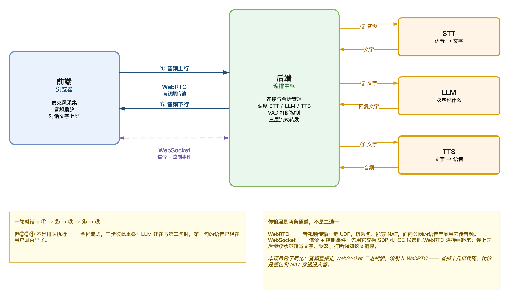
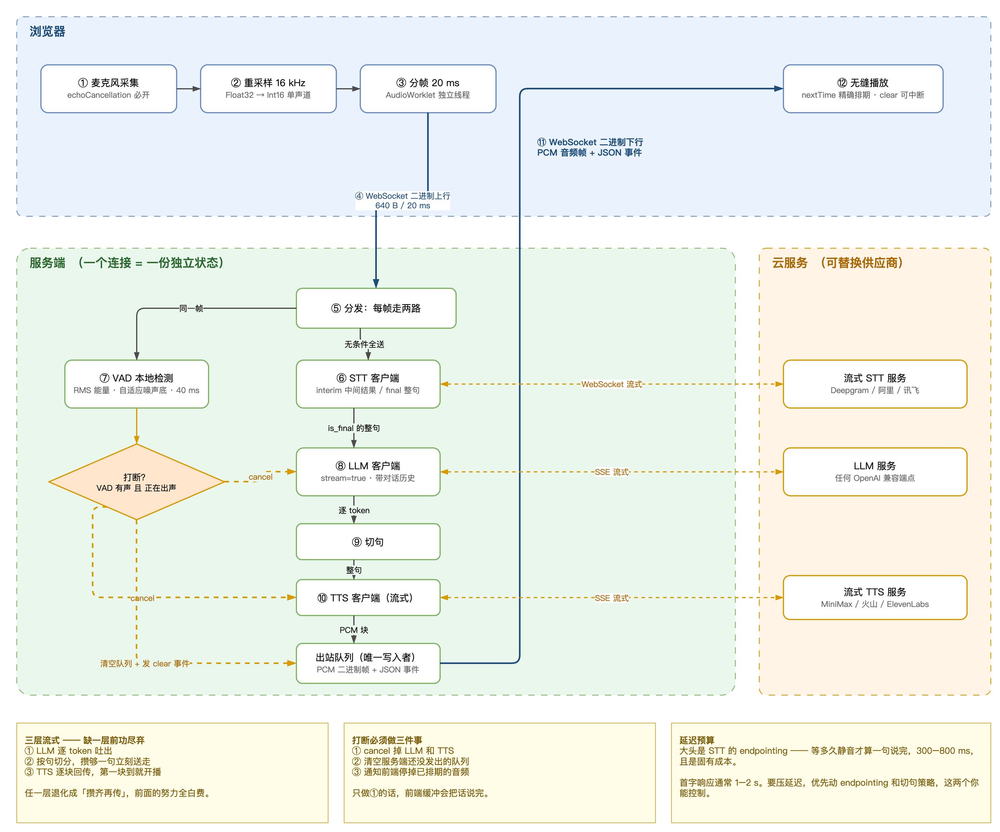

# 第01章 VoiceAgent 的总体架构与完整流程

读者若使用过语音助手类应用，或许注意到一个现象：向它提问之后，回答通常在一两秒内就开始出声，而不是等整段答案生成完毕再一次性播放。这个看似寻常的体验背后，是一条由四项技术串联、且全程流式推进的处理链路。

VoiceAgent 正是这样一套系统。它把语音采集、语音识别、语言模型推理、语音合成和音频回传组织成一条完整通路，让人与机器之间可以用说话的方式交互。这条通路上任何一个环节退化为“攒齐再传”，用户感受到的延迟都会成倍放大。

本章从概念出发，先厘清 VoiceAgent 由哪几项关键技术构成，再自上而下拆解它的总体架构，最后沿着一轮完整对话走一遍数据流向。读完本章，读者将能够说清一句话从麦克风进入、到语音从扬声器播出之间，系统内部依次发生了什么，以及各环节的供应商可以如何替换。

## 1.1 VoiceAgent 的概念与技术构成

### 1.1.1 语音智能体的定义

VoiceAgent 由 Voice 与 Agent 两部分构成。Voice 指语音，Agent 指智能体。合起来，它描述的是一类不仅能收发语音、而且具备理解与决策能力的软件系统。

单纯的语音播报或语音输入法不属于这一范畴，因为它们只完成信号与文本之间的转换，不产生判断。VoiceAgent 之所以称为智能体，关键在于链路中间接入了大语言模型（Large Language Model，LLM）：系统拿到用户说的话之后，由模型决定回应什么内容，而不是按预设脚本应答。

读者日常接触到的语音对话类应用，例如豆包的语音模式，就是这一形态最直接的例子。用户开口提问，应用听懂、思考并出声回答，这个过程构成了一个最基本的语音智能体。

把这套能力接到硬件上，它的意义会更明确。一台机器人本身不会听、不会说，也不知道该做什么。为它配上 VoiceAgent，相当于同时补齐了耳朵、嘴和大脑三样东西，人可以直接用自然语言指挥它。

> 注意：语音智能体与语音助手在中文语境下常被混用，本书统一使用语音智能体，指代具备大语言模型决策能力的完整系统。

### 1.1.2 四项关键技术

构成 VoiceAgent 的关键技术共有四项，各自负责链路上的一段职责，“如表1-1”所示。

**表 1-1 VoiceAgent 的四项关键技术**

| 技术 | 全称 | 职责 | 在链路中的位置 |
|------|------|------|--------------|
| WebRTC | Web Real-Time Communication | 音频的采集、传输与播放 | 首尾两端 |
| STT | Speech to Text | 把语音转换为文字 | 上行链路 |
| LLM | Large Language Model | 根据文字决定回复内容 | 链路中枢 |
| TTS | Text to Speech | 把文字转换为语音 | 下行链路 |

网页实时通信（Web Real-Time Communication，WebRTC）解决的是音视频本身的问题：声音怎么采集、怎么传输、怎么播放。它不关心内容，只负责让音频数据在浏览器与服务端之间可靠流动。

语音转文字（Speech to Text，STT）负责把采集到的音频还原成文字。这项技术在学术与工业界更常见的名称是自动语音识别（Automatic Speech Recognition，ASR），两者指向同一件事，本书在描述服务接口时使用 STT，在讨论识别原理时使用 ASR。

大语言模型（Large Language Model，LLM）处于链路中枢。它接收 STT 输出的文字，进行加工与推理，再逐步产出回复文字。系统的智能程度主要由这一环决定。

文字转语音（Text to Speech，TTS）负责把模型产出的回复文字合成为可播放的音频，交回前端出声。

> 注意：STT 与 ASR 是同一技术的不同称谓，阅读厂商文档时需留意，部分平台的接口命名使用 ASR，功能与 STT 一致。

## 1.2 总体架构

### 1.2.1 三段式结构

VoiceAgent 的总体架构可以划分为前端、后端编排中枢和云服务三段，各段之间通过明确的数据边界衔接，“如图1-1”所示。

前端是用户直接接触的一端，它可能是浏览器、移动应用，也可能是一台硬件设备。前端承担三项工作：通过麦克风采集音频、播放服务端回传的语音、把对话文字显示在屏幕上。用户在使用语音应用时看到的实时字幕，就来自第三项。

后端编排中枢是整套系统的调度者。它维护连接与会话状态，按顺序调用 STT、LLM 和 TTS 三类云服务，控制语音活动检测（Voice Activity Detection，VAD）触发的打断行为，并把三层数据流转发出去。这一层不实现任何识别或合成算法，它的价值在于编排。

云服务层由 STT、LLM、TTS 三类外部服务构成。它们彼此独立，可以按需替换供应商，后端只需保证调用协议对接正确。

### 1.2.2 编排中枢的职责边界

把 STT、LLM、TTS 三类能力直接串接起来，并不足以构成一个可用的语音智能体。中枢层需要额外承担四项职责。

第一项是连接与会话管理。每一路通话对应一份独立状态，包含对话历史、当前是否正在出声、音频出站队列等信息。这些状态不能在多路通话之间共享。

第二项是服务调度。中枢决定何时把音频送往 STT、何时把整句文字送往 LLM、何时把切分好的句子送往 TTS，并处理各服务的流式返回。

第三项是打断控制。当 VAD 检测到用户在系统出声期间开口，中枢需要中止当前的生成与合成过程。本章后面会展开这一项的具体机制。

第四项是三层流式转发。音频、转写文字和回复文字三类数据同时在链路上流动，中枢需要把它们分别转发到正确的方向，而不是等待某一类数据完整后再统一下发。

> 注意：会话状态必须与连接一一对应，若在多路通话间共享对话历史，会出现串音，即甲用户听到与乙用户对话相关的回复。

### 1.2.3 传输层的两条通道

前端与后端之间的通信不是单一通道，而是由两条性质不同的通道共同承担。

WebRTC 承担音视频传输。它基于用户数据报协议构建，具备抗丢包能力，并能穿透网络地址转换设备。面向公网的语音产品普遍用它传输音频，原因正在于此。

WebSocket 承担信令与控制事件。建立 WebRTC 连接需要先交换会话描述协议（Session Description Protocol，SDP）信息与交互式连接建立（Interactive Connectivity Establishment，ICE）候选地址，这些交换由 WebSocket 完成。连接建立之后，WebSocket 继续承载转写文字、状态变更、打断通知这类消息。

两条通道分工明确：一条传媒体，一条传控制信息，不存在二选一的关系。

## 1.3 一轮对话的完整流程

### 1.3.1 流程总览

把架构图放大到数据流层面，一轮对话可以拆成 12 个环节，“如图1-2”所示。

整个流程始于麦克风采集，终于前端无缝播放。中间经过重采样、分帧、上行传输、服务端分发、识别、推理、切句、合成、下行传输等步骤。需要强调的是，这些环节并非严格排队执行，中段的识别、推理、合成三步在时间上大量重叠。

### 1.3.2 音频上行链路

上行链路包含四个环节，负责把用户说的话变成服务端可处理的数据。

采集环节需要开启回声消除。若不开启，扬声器播出的语音会被麦克风重新采集，形成自激，系统会把自己的声音当作用户输入送去识别。

重采样环节把音频统一为 16 kHz 采样率、单声道、16 位整型格式。浏览器采集到的原始音频通常是 32 位浮点，采样率也不固定，而主流 STT 服务要求的正是 16 kHz 单声道，这一步不能省略。

分帧环节把连续音频切成 20 ms 一帧。该操作在独立的音频工作线程中完成，避免主线程卡顿影响采集时序。按 16 kHz、单声道、16 位计算，一帧的数据量为 640 字节。

上行环节把二进制音频帧发往服务端，同时复用同一通道传输控制事件。

### 1.3.3 服务端的双路分发

音频帧到达服务端后，会被分发到两条并行的路径，这是整个流程中容易被忽略的一步。

一路送往 STT 客户端。STT 服务返回两类结果：中间结果表示识别仍在进行，可用于实时字幕；最终结果表示一句话已经说完，可以交给模型处理。

另一路送往本地 VAD 检测。这里的 VAD 基于均方根能量计算，配合自适应噪声底，检测周期为 40 ms。它不依赖云服务，因此响应足够快，可以及时判断用户当前是否在说话。

关键在于，音频帧是无条件同时送往两路的，不因系统正在出声而暂停送往 VAD。正是这一点让打断成为可能：系统说话时麦克风依然在工作，用户随时开口都能被检测到。

> 注意：分发环节若在系统出声期间停止向 VAD 送帧，打断功能将完全失效，这是实现中的常见错误。

### 1.3.4 三层流式与切句

从模型推理到语音播出，中间有三层流式处理，任何一层退化都会让前面的努力失去意义。

第一层是模型逐词元输出。开启流式调用后，模型不等整段回复生成完毕，而是边生成边返回。

第二层是按句切分。系统持续接收模型返回的片段，一旦攒够一个完整句子，立即送往 TTS，不等后续内容。

第三层是合成结果逐块回传。TTS 同样采用流式接口，合成出第一块音频就开始回传，前端收到第一块即可起播。

三层配合的结果是，用户听到第一个字的时刻，大幅早于模型写完整段回复的时刻。若其中任意一层改为攒齐再传，例如等模型输出完整段落再切句，那么无论另外两层多快，首字响应时间都会被这一层拖住。

前端播放环节采用精确排期机制，按下一块音频的预期播放时刻依次排入队列，保证块与块之间无缝衔接，同时保留清空队列的能力以支持打断。

### 1.3.5 打断的完整处理

当 VAD 检测到有声、且系统正在出声时，打断条件成立。此时必须完成三件事，缺一不可。

第一件是取消模型与合成两侧的进行中请求，停止产生新内容。

第二件是清空服务端出站队列中尚未发出的音频块。这些数据已经合成完毕但还没送出，若不清理，它们会继续下行。

第三件是通知前端停止已经排期的音频播放。前端播放队列中可能已缓冲了数百毫秒的音频，服务端停止发送并不能让它立刻安静。

只做第一件事是实现打断时最常见的偏差。取消了模型请求，但前端缓冲区里的内容仍会完整播完，用户的主观感受是系统没有理会自己的打断。

> 注意：打断处理必须覆盖服务端队列与前端缓冲两处，只取消上游请求无法产生用户可感知的打断效果。

### 1.3.6 延迟的主要构成

在整条链路中，延迟的最大来源通常不是网络传输，也不是模型推理，而是 STT 的端点检测。

端点检测指的是，系统需要等待多长时间的静音，才判定用户这句话已经说完。这个等待时间常见取值在 300 ms 至 800 ms 之间，属于固有成本：等得太短会把一句话切成两半，等得太长则每轮对话都要多付出这段时间。

首字响应时间通常落在 1 至 2 s。若要压缩延迟，优先调整的是端点检测时长与切句策略，这两项由开发者掌握。模型推理速度与云服务网络往返时间则受制于外部条件，可调空间有限。

## 1.4 供应商选型

### 1.4.1 三类服务的可替换性

STT、LLM、TTS 三类服务在架构上彼此独立，供应商可以自由组合，不必绑定同一家。这种可替换性是刻意设计的结果，它让系统能够按语种、成本和效果分别选择最合适的服务。

STT 可选的形态包括本地部署与云服务两类。本地部署可通过 Ollama 等运行时接入，云服务方面，国内可选阿里云、腾讯云、火山引擎等平台，国外可选 Deepgram。

TTS 的可选范围与 STT 类似，同样覆盖国内外多家平台。

LLM 的选择空间最大。DeepSeek、MiniMax、Kimi 等模型均可接入，只要服务端提供的接口符合通用的对话补全形态即可。

### 1.4.2 中英文差异与方言支持

各家模型对中英文的支持效果存在明显差异，这是选型时首先要考虑的因素。

处理英文内容时，Deepgram 一类以英文为主要训练语料的服务表现更好。处理中文内容时，阿里云、腾讯云、火山引擎、MiniMax 等国内平台更为稳妥。

部分平台还提供方言支持，覆盖粤语、四川话等语种。方言识别的实际效果差异较大，选型阶段需要用真实语料逐家实测，不宜仅凭文档描述判断。

VAD 与打断能力同样存在厂商差异。不同平台提供的识别服务，在端点检测的灵敏度与稳定性上表现不一，这直接影响打断体验。

> 注意：中文场景下需确认目标平台的合成服务是否支持中文，部分以英文为主的平台其识别服务支持中文而合成服务不支持，向其提交中文文本不会报错，但输出结果不可用。

### 1.4.3 接口兼容性带来的迁移成本

LLM 一侧的迁移成本远低于另外两类服务，原因在于接口形态已经高度统一。

多数模型平台都提供兼容 OpenAI API 格式的端点。只要客户端按这一形态实现，更换模型时只需调整服务地址、密钥和模型名称三项配置，调用代码不必改动。

STT 与 TTS 一侧则没有这样的统一标准。各家的连接方式、音频格式要求、结果回调结构各不相同，更换供应商通常意味着重写一个客户端实现。因此在项目初期，为这两类服务定义一层内部接口、把厂商差异隔离在实现内部，是值得投入的工作。

本书配套源码接入了阿里云与 Deepgram 两套实现，读者可以对照两者的差异，理解这层抽象需要覆盖哪些内容。

至此，VoiceAgent 的三段式架构、一轮对话的十二个环节，以及三类云服务的可替换性都已交代清楚。这条链路上的每一个环节都有独立的原理与工程取舍，把它们逐个拆开，才能理解一个响应流畅、可被打断的语音智能体是如何构成的。
