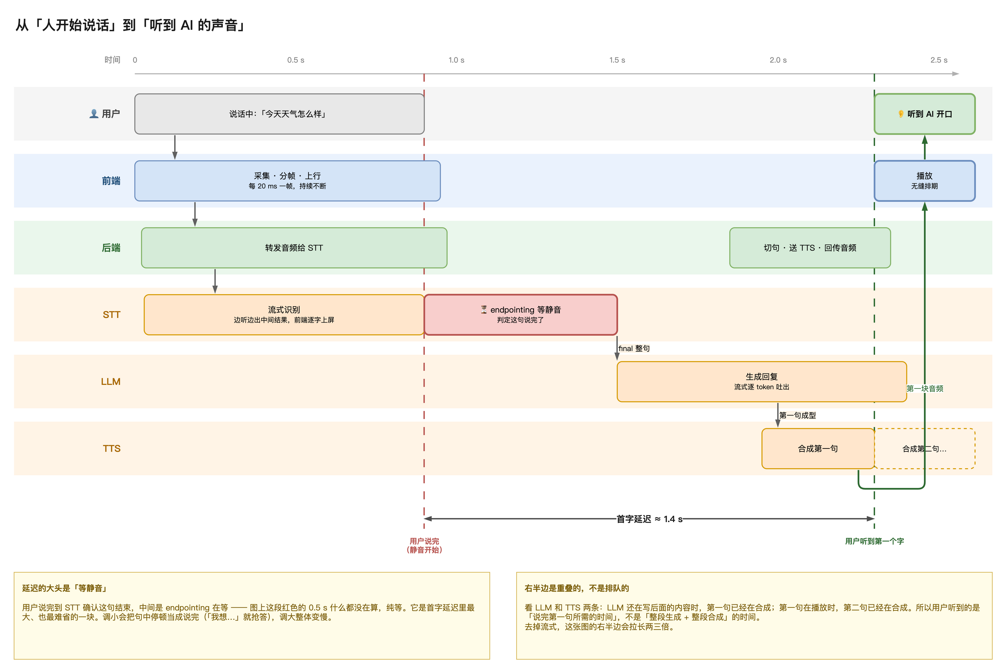
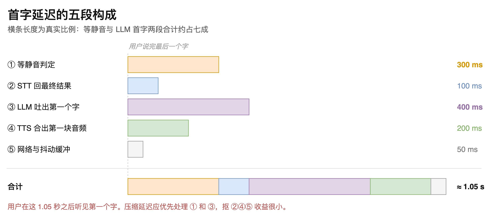
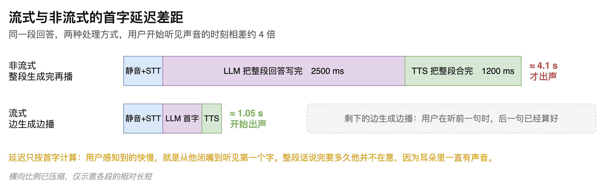

# 第02章 对话时间线与延迟分析

读者如果试用过语音助手类产品，多半有过这样的体感：有的产品说完就答，有的要愣上好几秒。同样是把语音识别、大语言模型和语音合成串起来，差距为何如此明显。

延迟是语音智能体的第一性问题。它不是一个笼统的整数，而是由五段耗时叠加而成，各段的量级相差数倍，可优化的空间和代价也完全不同。不知道哪一段占大头，优化就只能靠猜。

本章沿着一次真实对话的时间轴走一遍，先看清各环节在时间上如何排布与重叠，再把从用户说完到听见回答这段延迟拆成五份逐一称重，最后给出每一段的压缩空间和相应代价。读完本章，读者面对一个响应偏慢的语音智能体，将能判断该从哪一段入手，而不是逐个环节盲目试。

## 2.1 一轮对话的时间线

### 2.1.1 从开口到听见的完整时序

以用户说出“今天天气怎么样”为例，从他开始说话到听见回答的第一个字，整条链路的时序“如图2-1”所示。

时间轴自左向右推进，纵向分为用户、前端、后端、STT、LLM、TTS 六条泳道。用户说话本身占用约 0.5 s，这段时间里前端持续采集、分帧并上行，每 20 ms 一帧，不间断地送往后端；后端把音频转发给 STT 服务，STT 边听边返回中间结果，前端据此逐字上屏。

用户说完最后一个字之后，链路并不会立即进入下一环节。此时进入端点检测的等待期，系统需要确认这句话确实结束了，才会把最终文本交给 LLM。模型开始流式产出内容后，系统攒够第一句就送往 TTS 合成，合成出第一块音频即回传前端播放。用户听见第一个字的时刻，图上标注为距离说完约 1.4 s。

> 注意：前端上行的帧长是 20 ms 而非 20 s，这一数量级决定了上行是持续不断的细流，而不是分段批量传输。

### 2.1.2 识别、推理与合成的重叠关系

时间线右半部分最容易被误读成一条串行流水线，即识别完成后开始推理、推理完成后开始合成。实际情况是这三段大量重叠。

观察 LLM 与 TTS 两条泳道可以看出，模型还在生成后续内容时，第一句已经进入合成；第一句正在播放时，第二句已经合成完毕。因此用户等待的是“说完第一句所需的时间”，而不是“整段生成加整段合成”的时间。

这一点决定了首字延迟的量级。若去掉流式处理，让每一段都攒齐再传，时间线的右半部分会拉长两至三倍。

### 2.1.3 首字延迟的定义

衡量语音智能体的响应速度，业界用的指标是首字延迟，即从用户说完最后一个字，到他听见回答第一个字之间的间隔。

之所以只算到第一个字，是因为后续内容在用户收听前一句的同时就已经算好了。用户耳朵里始终有声音，整段回答说完需要多久，他并不关心。真正影响体验的是那段“说完之后的沉默”。

图 2-1 中标注的首字延迟约为 1.4 s。笔者认为这个量级对用户是可以接受的：说完一句话，等一秒多就听到回应，符合日常对话的心理预期。如果实测值明显大于这个量级，就说明方案存在需要排查的问题。

> 注意：首字延迟不包含用户自己说话所占的时间，图 2-1 中说话段的 0.5 s 不计入延迟。

## 2.2 延迟预算的五段构成

### 2.2.1 五段的典型耗时

把首字延迟拆开，它由五段串行耗时构成，各段的典型值与相对长短“如图2-2”所示。

五段的名称、典型耗时和成因“如表2-1”所示。

**表 2-1 首字延迟的五段构成**

| 序号 | 环节 | 典型耗时 | 时间花在哪里 |
|------|------|---------|------------|
| 1 | 等静音判定 | 300 ms | VAD 连续检测到足够时长没有声音，才判定这句说完了 |
| 2 | STT 回最终结果 | 100 ms | 云端模型确认句子边界，把最终文本回传 |
| 3 | LLM 吐出第一个字 | 400 ms | 排队等推理，读完系统提示词和对话历史，算出首个词元 |
| 4 | TTS 合出第一块音频 | 200 ms | 第一句送去合成，返回第一段可播放的音频 |
| 5 | 网络与抖动缓冲 | 50 ms | 音频包传到浏览器，加上播放前的少量缓冲 |

五段相加约 1.05 s。其中第 1 段和第 3 段合计占了约七成，这两处是优化的着力点，在第 2、4、5 段上抠时间收益很小。

> 注意：表 2-1 给出的是各段典型值之和，图 2-1 标注的 1.4 s 是一次具体对话的实测值，两者口径不同，不必强行对齐。

### 2.2.2 等静音判定为何最难压缩

第 1 段是五段里最特殊的一段：这 300 ms 里系统什么都没有计算，纯粹在等。

等待的原因在于，机器无法预知用户是否已经把话说完。唯一可用的信号是静音时长：连续静音超过设定阈值，就判定这句结束。阈值设得越短，等待越少，但句中正常停顿会被误判为说完。用户说“我想……”只是在组织语言，系统却已经抢先应答。阈值设得越长，误判越少，但每一轮对话都要多付出这段等待。

这段耗时因此是固有成本，不是实现不当造成的。它也是首字延迟里最大、同时最难省的一块。

### 2.2.3 流式与非流式的差距

流式处理对首字延迟的影响，用同一段回答的两种处理方式对比最直观，“如图2-3”所示。

若不采用流式，等模型把整段回答写完再整体合成，各段耗时会变成：等静音与识别照旧，模型写完整段约 2500 ms，合成整段约 1200 ms，合计约 4.1 s 才开始出声。

采用流式之后，模型吐出首个词元即开始切句，合成出第一块音频即开始播放，约 1.05 s 就能出声，剩余内容边生成边播。用户在听前一句的时候，后一句已经算好。

两者相差约 4 倍。模型逐词元输出、按句切分送出、合成结果逐块回传，这三层流式缺一不可：任何一层退化成攒齐再传，都会把这 4 倍的差距吃掉一部分。

## 2.3 各段的优化空间与代价

### 2.3.1 端点检测阈值的权衡

第 1 段的等静音时长可以从 300 ms 压到 150 ms，做法是调小端点检测阈值，少等一会儿就认定说完了。

代价是用户说到一半停顿，就会被当成说完，导致系统抢话。这个阈值没有普适的正确值，实际取值常在 400 ms 至 800 ms 之间，需要按具体场景实测确定。面向短问答的场景可以取小值，面向用户需要边想边说的场景则应取大值。

### 2.3.2 模型首字时间的取舍

第 3 段的模型首字时间可以从 400 ms 压到 200 ms，可选手段有三个方向：换用更小更快的模型，缩短系统提示词和携带的对话历史，减少检索增强生成召回的条数。

三种手段的代价都是回答质量下降，这是整个预算表里最难权衡的一处。

有一类情况属于配置失误而非权衡，需要单独指出：部分模型提供深度思考模式，开启后模型会在回答前先输出一段推理过程。这段推理在文本场景里是有价值的，但在语音场景中，用户只会听到一段长时间的沉默。语音智能体应当关闭这类模式，选用非思考模型。

> 注意：深度思考模式在语音场景中会把首字延迟拉长数倍，接入模型时应确认该模式处于关闭状态。

### 2.3.3 合成与网络的工程收益

第 4 段的合成首块时间可以从 200 ms 压到 100 ms，做法是选用支持流式返回的合成服务，并在切句时让第一句尽量短，早一点凑够一句发出去。

这一项几乎没有代价，属于纯工程收益，应当优先实施。

第 5 段的网络耗时在同区域部署下约为 50 ms，压缩空间有限，也没有代价。但跨地域访问时它可能涨到 200 ms 以上，那种情况下就值得处理，做法是服务器就近部署，并选择同区域的模型服务。

第 2 段的识别耗时由供应商决定，基本压不动，除非更换供应商或自行部署识别模型。

各段的压缩空间与代价汇总“如表2-2”所示。

**表 2-2 五段延迟的压缩空间与代价**

| 环节 | 可压缩到 | 手段 | 代价 |
|------|---------|------|------|
| 等静音判定 | 150 ms | 调小端点检测阈值 | 句中停顿被误判为说完，系统抢话 |
| STT 回最终结果 | 基本不可压 | 更换供应商或自行部署 | 迁移成本高 |
| LLM 吐出第一个字 | 200 ms | 换更小的模型，缩短提示词与历史，减少召回条数 | 回答质量下降 |
| TTS 合出第一块音频 | 100 ms | 选用流式合成，让第一句尽量短 | 几乎没有，优先实施 |
| 网络与抖动缓冲 | 50 ms | 服务器与模型服务就近同区域部署 | 没有 |

## 2.4 延迟异常的排查

### 2.4.1 用户可感知的延迟档位

判断一个语音智能体够不够快，需要有参照物。真人对话的轮次间隔大约 200 ms，这是感受上的天花板，也是为什么 1 s 左右已经算不错的原因。

不同延迟量级对应的用户感受“如表2-3”所示。

**表 2-3 首字延迟与用户感受的对应关系**

| 首字延迟 | 用户感受 |
|---------|---------|
| 0.5 至 1.5 s | 自然，接近真人对话，多数产品处于这一档 |
| 1.5 至 3 s | 明显在等待，体验开始下滑 |
| 超过 3 s | 用户以为连接断开，会重复提问 |

> 注意：超过 3 s 时用户往往会重复提问，此时系统会收到两次输入，若打断处理不当会出现回答叠加。

### 2.4.2 常见的延迟来源

实测延迟明显超出预期时，笔者建议按以下顺序排查。

首先确认模型是否开启了深度思考模式。这是最容易出现、影响也最大的一项，且与代码实现无关，属于配置问题。

其次检查网络状况。链路上有三次云服务往返，识别、推理、合成各一次，网络慢会同时拖慢这三段。跨地域访问是常见诱因。

再次检查各服务是否都采用了流式接口。识别一侧尤其需要确认，部分供应商提供的是整段语音送入、整段文本返回的非流式接口，这类接口无法边听边出中间结果，会把第 1、2 两段的耗时显著拉长。阿里云、腾讯云、火山引擎以及 Deepgram 都提供流式识别，选型时应当确认这一点。

最后逐段计时定位。按表 2-1 的五段划分分别打点，与典型值对照，偏差最大的那一段就是问题所在。

> 注意：排查延迟时应先确认各服务均使用流式接口，非流式接口会让本章讨论的全部优化手段失效。

至此，首字延迟的五段构成、各段的压缩空间与代价、以及延迟异常的排查顺序都已交代清楚。五段之中，等静音判定既占大头又最难压缩，它背后是一个更根本的问题：机器如何判断人已经把话说完。这个问题的答案，决定了语音智能体在流畅与抢话之间的位置。
