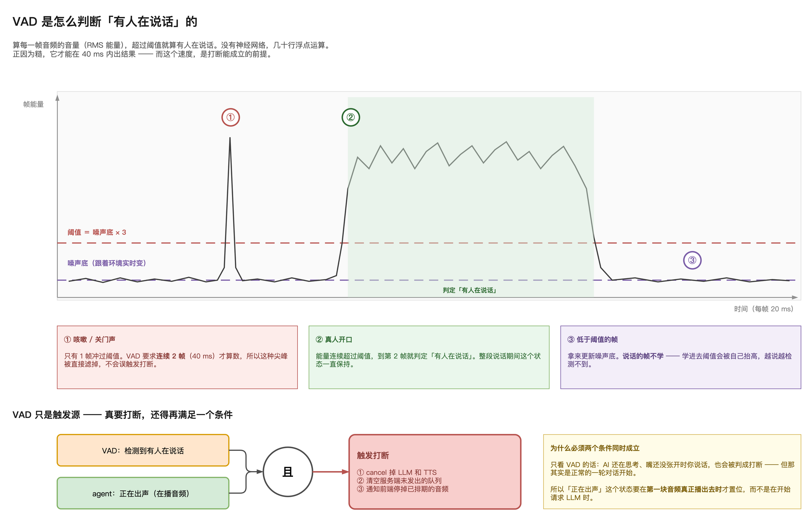
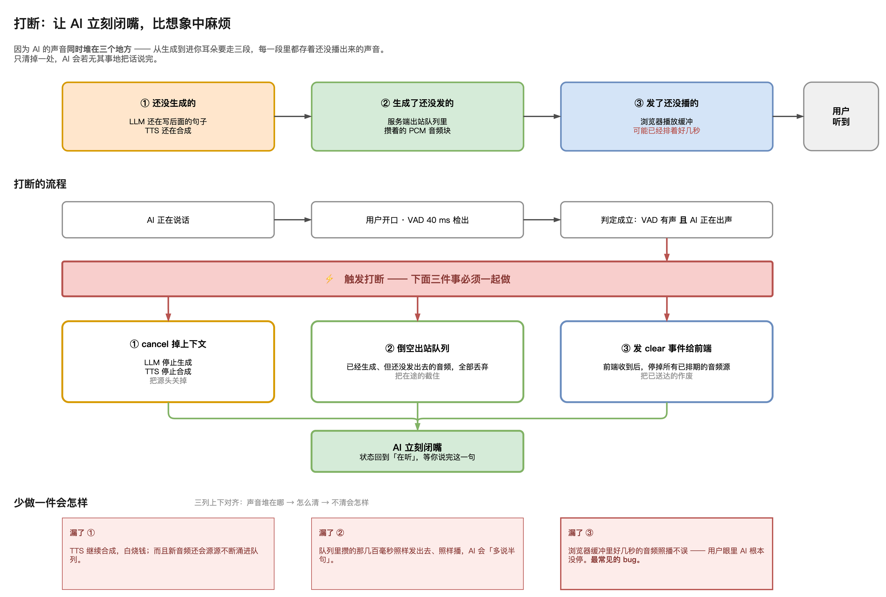

# 第03章 对话打断：VAD 原理与打断流程

读者与人交谈时，若对方说到一半跑偏了，多半会直接开口打断，对方也随即停下。这个动作在人与人之间自然到无需思考，但要让语音智能体做到同样的事，需要分别解决两个问题：机器如何知道有人开口了，以及知道之后如何让自己真正闭嘴。

前一个问题由一项专门的检测技术负责，它必须在几十毫秒内给出答案，慢一步打断就失去意义。后一个问题比想象中麻烦：系统已经产生的声音同时堆在三个地方，只清理其中一处，它会若无其事地把话说完。

本章先拆开这项检测技术的判定方法，说明它如何用几十行浮点运算把人声与关门声区分开；再给出打断成立的完整条件，以及触发之后必须同时完成的三件事。读完本章，读者将能判断一个语音智能体的打断做得是否到位，也能定位自己实现中打断失效的原因出在哪一段。

## 3.1 语音活动检测的判定方法

### 3.1.1 检测要回答的问题

语音活动检测（Voice Activity Detection，VAD）回答的问题只有一个：此刻有没有人在说话。

它不识别说话内容，不区分说话人，也不关心语种，输出只有有声与无声两种状态。正因为职责如此单一，它才可能做得足够快，而速度恰恰是打断能够成立的前提。

在语音智能体的链路中，麦克风采集到的音频帧会被同时送往两条路径：一条送往云端的语音识别服务，负责把话转成文字；另一条送往本地的 VAD，负责判断用户此刻是否在说话。两条路径彼此独立，VAD 不依赖任何云服务，因此不受网络往返时间的影响。

> 注意：VAD 的输出不包含任何语义信息，判断用户说了什么是语音识别的职责，两者不能相互替代。

### 3.1.2 基于帧能量的判定

VAD 的判定方法比多数人预期的要朴素：逐帧计算音频的均方根（Root Mean Square，RMS）能量，也就是这一小段声音的响度，能量超过阈值就认定有人在说话。

音频按每帧 20 ms 切分。整个判定过程没有神经网络，没有模型加载，只是几十行浮点运算。正因为做法粗糙，它才能在 40 ms 内出结果。

完整的判定过程“如图3-1”所示。

图中横轴是时间，每格一帧；纵轴是该帧的能量。灰色的水平线是随环境实时变动的噪声底，它上方的虚线是判定阈值，取值为噪声底的 3 倍。能量柱越过阈值的区段被判定为有人在说话，图中以绿色标出。

图上三个标注点分别对应三种典型情形，下面逐一说明。

### 3.1.3 噪声尖峰的过滤

标注点①是一次咳嗽或者关门声。这类声音的能量确实冲过了阈值，但只持续一帧。

如果 VAD 见到一帧超标就判定有人说话，用户身边任何一点响动都会触发打断，语音智能体会在对话过程中被反复掐断，完全无法使用。

解决办法是加一个连续性要求：必须连续 2 帧都超过阈值才算数。2 帧是 40 ms，一次咳嗽的冲击通常达不到这个长度，于是这类尖峰被直接滤掉。

标注点②是真人开口。人说话的能量会连续多帧保持在阈值之上，因此到第 2 帧就满足了连续性要求，判定成立。此后整段说话期间，这个状态一直保持。

> 注意：连续帧数是灵敏度与误触发之间的权衡，取值过大会让打断变迟钝，用户需要多说几个字系统才有反应。

### 3.1.4 噪声底的自适应更新

阈值不是一个写死的常数。同一套参数，在安静的书房和在开着空调的会议室里，表现会完全不同。因此噪声底必须跟着环境实时更新。

标注点③说明的就是更新规则：只有低于阈值的帧才拿来更新噪声底，被判定为说话的帧不参与。

这条规则中排除说话帧的部分尤其关键。若把说话帧也学进去，噪声底会被用户自己的声音抬高，阈值随之水涨船高，结果是用户说得越久，系统越检测不到他在说话，打断功能会在一次长对话中逐渐失灵。

> 注意：噪声底只从静音帧学习，这一条在实现时容易被忽略，表现为打断在对话初期正常，说得越久越迟钝。

## 3.2 打断成立的两个条件

### 3.2.1 检测到有人说话并不等于要打断

VAD 只是触发源。仅凭它的输出就执行打断，会在一个很常见的场景下出错。

设想用户提问完毕，系统正在调用大语言模型（Large Language Model，LLM）生成回复，此时还没有任何声音播出。如果用户在这个空档补充了一句，VAD 会立刻检出有人在说话。但这显然不是打断，而是一轮正常对话的开始，系统本来就该听完再答。

所以打断的判定需要两个条件同时成立：

- VAD 检测到有人在说话
- 语音智能体正在出声，也就是正在播放音频

两个条件缺一不可。只有在系统确实已经开口的情况下，用户开口才构成打断。

### 3.2.2 正在出声状态的置位时机

第二个条件看似简单，实现时却有一个容易踩的坑：正在出声这个状态，究竟在哪一刻置位。

直觉的做法是在开始请求模型时就置位，理由是从这一刻起系统已经进入回复流程。但这样做等于把模型推理和语音合成的耗时也算作出声期间，而那段时间系统其实是静默的。用户在静默期开口，会被错判成打断。

正确的做法是等第一块音频真正播放出去时才置位。在此之前，无论模型是否在生成、合成是否在进行，系统对用户而言都还没有开口。

> 注意：正在出声的状态应由前端实际起播来驱动，而不是由服务端发起请求来驱动，两者相差的正是首字延迟那一段时间。

## 3.3 打断的执行过程

### 3.3.1 未播出的音频同时存在于三处

判定成立之后，真正的麻烦才开始。让语音智能体立刻闭嘴，比想象中复杂得多，原因在于它的声音从生成到进入用户耳朵要走三段路，每一段里都存着尚未播出的内容。

完整的打断流程“如图3-2”所示。

三处未播出的音频分别是：

第一处是尚未生成的内容。模型可能还在写后面的句子，语音合成可能还在处理前面已经切分好的句子。这部分声音还不存在，但正在被源源不断地制造出来。

第二处是已经生成但尚未发出的内容。服务端的出站队列里攒着若干脉冲编码调制（Pulse Code Modulation，PCM）音频块，它们已经合成完毕，只是还没轮到发送。

第三处是已经发出但尚未播完的内容。浏览器的播放缓冲区里可能已经排了好几秒的音频，这些数据早已离开服务端，控制权不在服务端手里。

> 注意：三处音频的存在是流式架构的必然结果，不是实现缺陷，正是它们让首字响应得以压缩到 1 秒量级。

### 3.3.2 必须同时完成的三件事

三处音频对应三个清理动作，必须一起做。

第一件是取消上游。向模型和语音合成两侧发出取消请求，停止产生新内容。这一步关掉的是源头。

第二件是倒空出站队列。把服务端已经合成、尚未发出的音频块全部丢弃。这一步截住的是在途的内容。

第三件是通知前端清空。向前端发送一个清空事件，前端收到后停掉所有已经排期的音频源。这一步作废的是已经送达的内容。

三件事全部完成，语音智能体才真正闭嘴，状态回到聆听，等待用户把这句话说完。

### 3.3.3 遗漏任一件的后果

这三件事在代码中往往分散在不同模块，实现时很容易只做其中一两件。每一件的遗漏都有明确且可观测的表现，“如表3-1”所示。

**表 3-1 三处未播出音频的清理方式与遗漏后果**

| 音频所在位置 | 清理动作 | 遗漏后的表现 |
|------------|---------|------------|
| 尚未生成 | 取消模型生成与语音合成 | 合成持续进行，既浪费额度，新音频还会不断涌进队列 |
| 已生成未发出 | 倒空服务端出站队列 | 队列中攒下的数百毫秒照常发出并播放，系统会多说半句 |
| 已发出未播完 | 向前端发送清空事件 | 浏览器缓冲区里数秒音频照常播完，用户看来系统根本没停 |

三者之中，第三件被遗漏的情况最为常见。原因是服务端视角下打断似乎已经完成：请求取消了，队列清空了，日志上一切正常。但用户听到的仍是系统在滔滔不绝，因为那几秒音频早就到了浏览器，服务端停止发送对它们没有任何影响。

> 注意：排查打断失效时，应先确认前端是否收到并处理了清空事件，仅凭服务端日志无法判断用户实际听到了什么。

## 3.4 检测速度与实现规模

### 3.4.1 40 毫秒是打断成立的前提

VAD 的检测周期是 40 ms。这个数字值得单独说明。

1 秒是 1000 ms，40 ms 是其中的二十五分之一。在用户开口之后的这段时间内完成判定，加上后续三件清理动作的执行时间，系统停下来的动作在用户感受里几乎是即时的。

若检测慢到数百毫秒，用户开口之后系统还要继续说上小半句才停，打断的意义就所剩无几。检测速度不是一项可以慢慢优化的性能指标，而是这个功能能否成立的前提。

这也解释了 VAD 为什么不用更精确的方法。基于神经网络的检测在准确率上确实更好，但引入的推理耗时会直接冲击这个前提。

### 3.4.2 简单实现的合理性

VAD 的代码量通常很小，几十行浮点运算就能覆盖能量计算、阈值比较、连续帧计数和噪声底更新这四件事。

代码少并不意味着可以随意对待。真正需要反复调试的不是算法本身，而是三个参数的取值：噪声底的倍数、连续帧的数量、噪声底的更新速率。这三个值决定了系统在安静环境与嘈杂环境下的表现差异，需要用真实场景的录音逐一实测。

> 注意：更换麦克风或部署到新的声学环境后，这三个参数往往需要重新调整，不能沿用默认值直接上线。

至此，语音打断的两个环节都已交代清楚：检测环节用帧能量、自适应噪声底和连续帧要求，在 40 ms 内判断出用户是否开口；执行环节则要同时清理三处未播出的音频，才能让语音智能体真正停下。判定的准确与执行的彻底，缺任何一半，用户感受到的都是这个系统不会听人说话。
