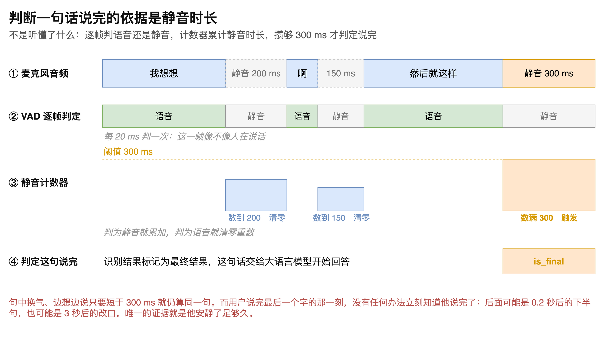
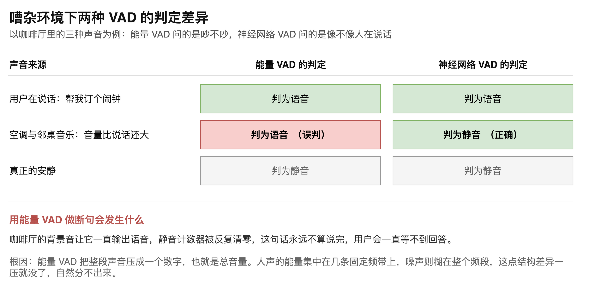
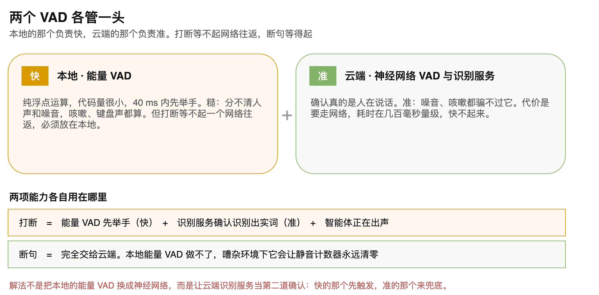

# 第04章 断句原理：本地 VAD 与神经网络 VAD

用户把一句话说完之后，语音智能体应该等多久才开始回答？这个看似琐碎的决定同时卡着两头：断得太早，用户话还没说完就被抢答，表达被硬生生截断；断得太晚，每一轮对话都要额外多等一段沉默，响应显得迟钝。

真正的难处在于，机器并没有办法在用户闭嘴的那一刻就知道他说完了。一句“我想吃”后面可能跟着 0.2 秒后的“饭”，也可能是 3 秒后的“算了”，两者在声音上没有任何区别。系统唯一能依靠的证据，是他安静了足够久。

本章先拆开这个判定过程，说明静音计数器如何工作、阈值如何取值；再解释为什么这件事必须交给云端的神经网络检测，本地那套基于音量的算法在嘈杂环境下会彻底失效；最后给出两套检测各自的归属。读完本章，读者将能说清一个语音智能体在什么时刻认定用户说完了，以及为什么商用系统需要同时部署两套检测。

## 4.1 断句的判定依据

### 4.1.1 断句在链路中的位置

语音智能体处理一轮对话的顺序是：麦克风采集音频，音频送往语音转文字（Speech to Text，STT）服务持续识别，识别结果在某个时刻被标记为最终结果，这句话随即交给大语言模型（Large Language Model，LLM）生成回复，回复再经语音合成送回用户耳朵。

断句发生的位置，正是从识别到模型推理的这个交接点。判定这句话已经说完，识别结果才会被标记为最终结果，后面的环节才会启动。这项判定在工程上称为端点检测（endpointing）。

判定早一帧或晚一帧，影响的不只是这一句话的完整性，还直接计入用户感知到的响应延迟，因为等待静音的这段时间里系统什么都没做，纯粹在等。

> 注意：端点检测的耗时属于首字延迟中固有的一段，它不是可以通过优化代码消除的开销，只能通过调整阈值来权衡。

### 4.1.2 判定靠的是静音时长

断句的依据不是理解了内容，而是静音持续了多久。

具体做法是：语音活动检测（Voice Activity Detection，VAD）逐帧判断当前这一帧是语音还是静音，每 20 ms 判一次；一个计数器累计连续静音的时长；累计值达到阈值，通常是 300 ms，就判定这句话说完了。

完整的判定过程“如图4-1”所示。

图中第一行是麦克风采集到的原始音频，用户说了“我想想”“啊”“然后就这样”三段话，中间夹着 200 ms 和 150 ms 两处停顿，最后是一段 300 ms 的静音。第二行是 VAD 对每一帧的判定结果。第三行是静音计数器的累计值。第四行是判定结果。

### 4.1.3 计数器的清零规则

计数器的规则只有两条：判为静音就累加，判为语音就清零重数。

正是清零这条规则，让句中的自然停顿不会被误判。图中第一处停顿累计到 200 ms 时，用户又开口说了“啊”，计数器立刻归零；第二处停顿累计到 150 ms 时同样被清零。两处都没有达到 300 ms，所以三段话被正确地归为同一句。

只有最后那段静音一路累加到 300 ms，中间没有任何语音帧打断，判定才成立。

这条规则带来的效果是，用户在句子中间换气、边想边说、犹豫片刻，只要单次停顿短于阈值，系统都会耐心等下去，把它们当作同一句话的组成部分。

> 注意：计数器累计的是连续静音，不是累计静音总量，把两者混淆会导致句中多次短停顿被错误地叠加成一次长静音。

### 4.1.4 无法提前知晓的根本原因

有一个事实值得单独强调：在用户说完最后一个字的那一刻，系统没有任何办法立刻知道他说完了。

这不是技术不够先进，而是信息本身不存在。用户说出“我想吃”之后，声音信号里不包含任何标记来区分他是要接着说“饭”，还是已经打算换个话题。两种情况在那一刻的音频上完全相同，差别只体现在接下来的沉默有多长。

所以等待静音不是一种偷懒的近似方案，而是目前唯一可用的证据。这也解释了为什么这段等待时间无法通过任何工程手段消除。

### 4.1.5 阈值取值的权衡

既然等待时长是唯一的判据，阈值的取值就直接决定了系统的性格，“如表4-1”所示。

**表 4-1 静音阈值取值对交互体验的影响**

| 阈值取值 | 用户感受 | 主要问题 |
|---------|---------|---------|
| 明显偏小 | 系统反应很快，几乎不用等 | 句中停顿被当成说完，用户频繁被抢话打断 |
| 取值适中 | 节奏接近自然对话 | 需要按具体场景实测确定，没有通用值 |
| 明显偏大 | 系统显得稳重但迟钝 | 每轮对话都多等一段沉默，首字延迟明显增加 |

实际取值常落在 300 ms 至 800 ms 之间。面向短问答的场景可以取小值，用户通常一口气说完；面向需要边想边说的场景则应取大值，否则用户每次思考停顿都会被抢话。

## 4.2 能量 VAD 为何不能承担断句

### 4.2.1 两种检测提出的问题不同

VAD 有两种常见实现，它们向音频提出的问题完全不同。

基于能量的 VAD 计算每一帧的音量，问的是这一帧吵不吵。基于神经网络的 VAD 则学习过人声的特征，问的是这一帧像不像人在说话。

在安静环境里，两者的结论一致，区别显不出来。差异要到嘈杂环境才暴露，“如图4-2”所示。

图中以咖啡厅为例列出三种声音。用户说话时，两种检测都判为语音，结论相同。真正安静时，两者也都判为静音。唯一分歧出现在第二行：空调声与邻桌音乐的音量可能比用户说话还大，能量 VAD 只看音量，把它判为语音；神经网络 VAD 听得出这不是人声，判为静音。

### 4.2.2 误判造成的后果

这一格误判的后果远比它看上去严重。

咖啡厅的背景音是持续存在的。能量 VAD 一直输出语音，静音计数器就被反复清零，永远累加不到 300 ms。结果是这句话永远不算说完，识别结果永远不会被标记为最终结果，模型永远不会被调用。

用户的体验是：说完话之后，系统毫无反应。

> 注意：这类故障在安静的开发环境中完全复现不出来，只有把设备带到有持续背景音的真实场景才会暴露。

### 4.2.3 失效的根本原因

能量 VAD 的问题不在于阈值没调好，而在于它丢掉了区分所需的信息。

它把整段声音压缩成一个数字，也就是总音量。而人声与噪声的真正差别是频谱结构：人声的能量集中在几条固定的频带上，噪声则均匀地糊在整个频段。这点结构差异一旦被压成单个音量值，就再也找不回来了。

换句话说，无论怎么调参数，一个只知道总音量的算法都不可能区分出人声。神经网络 VAD 之所以能做到，正是因为它看的是频谱结构而不是总量。

## 4.3 两个 VAD 的分工

### 4.3.1 本地与云端各自的长短

既然能量 VAD 在嘈杂环境下不可靠，为什么不干脆全部换成神经网络 VAD？

因为两者的取舍不在同一个维度上，“如图4-3”所示。

本地的能量 VAD 胜在快。它是纯浮点运算，代码量很小，能在 40 ms 内给出结果。代价是糙：分不清人声和噪音，咳嗽声、键盘声都会被算作语音。

云端的神经网络 VAD 胜在准。噪音、咳嗽、音乐都骗不过它。代价是要走一个网络往返，耗时在几百毫秒量级。

两者的长处正好错开，因此不是替换关系，而是各管一头。

### 4.3.2 打断与断句的不同归属

分工的依据是两项功能对时间的容忍度不同。

打断必须快。用户开口之后系统还要说上小半句才停，打断就失去了意义，所以它等不起一个网络往返，检测必须放在本地。但本地检测糙，容易把咳嗽和键盘声当成用户开口。解决办法不是把本地换成神经网络，而是加一道确认：能量 VAD 先举手触发，云端识别服务确认确实识别出了实词，再加上智能体当前正在出声这个条件，三者同时成立才真正执行打断。快的那个先触发，准的那个来兜底。

断句则等得起。用户说完之后本来就要等上数百毫秒的静音，再多一个网络往返并不改变量级。而它对准确性的要求极高，一次误判就会让整句话卡死。所以断句完全交给云端，本地的能量 VAD 承担不了这项职责。

> 注意：把断句也放在本地是一个常见的错误决定，它在开发环境下工作正常，上线到真实嘈杂环境会表现为用户说完话后系统长时间无响应。

### 4.3.3 云端 VAD 的实际位置

需要说明的是，云端的神经网络 VAD 通常并不是一个独立的服务，开发者也不会单独调用它。

阿里云、腾讯云、火山引擎以及 Deepgram 等厂商，都把 VAD 包含在自动语音识别（Automatic Speech Recognition，ASR）服务内部。开发者持续把音频流推给识别服务，服务在实时转写的同时完成端点检测，并通过结果中的最终结果标记告知这句话已经结束。

这意味着断句的阈值往往是识别服务的一个参数，而不是应用代码里的一个变量。调整它需要查阅对应厂商的接口文档，不同厂商的参数名称和取值范围各不相同。

> 注意：更换识别服务供应商时，端点检测的行为可能随之改变，即使业务代码完全没动，对话节奏也会有明显差异。

至此，断句的完整机制已经交代清楚：判定依据是连续静音时长而非语义理解，计数器遇到语音帧即清零，因此句中停顿不会被误判；这项判定必须交给能分辨人声的神经网络检测，基于音量的本地检测在有持续背景音时会让计数器永远归零。而本地检测并非没有用武之地，它以速度换取精度，承担的是打断的第一道触发。一个商用级的语音智能体，两套检测缺一不可。
