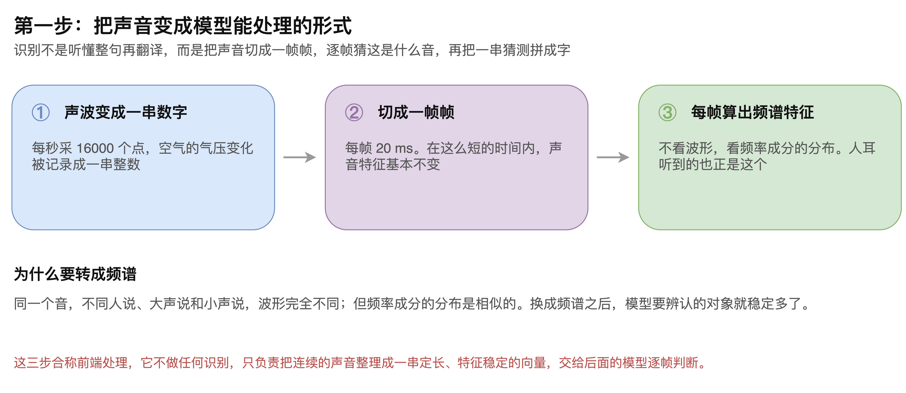
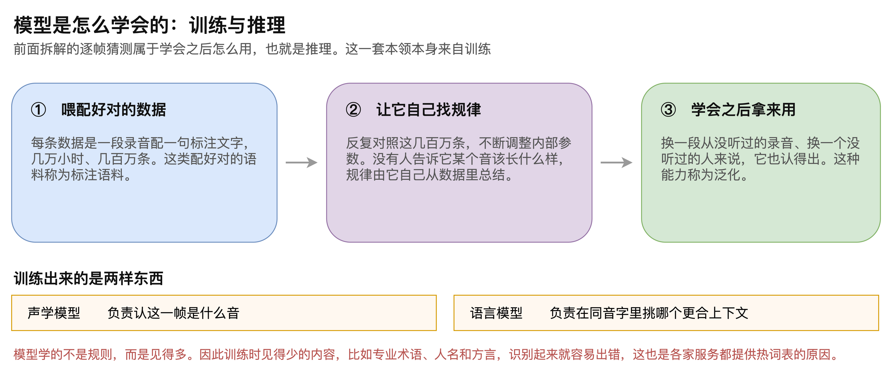

# 第05章 实时语音识别的 ASR 原理

读者在使用语音助手时，多半见过这样的画面：话才说了一半，屏幕上的字已经逐个冒出来，而且冒出来之后还会自己改。这两件事合在一起，恰好暴露了实时语音识别的工作方式。

它并不是听懂整句再翻译成文字。真实的做法是把声音切成一帧帧，对每一帧独立猜测这是什么音，再把一长串猜测拼接成字。因为是逐帧进行的，所以能边听边出结果；也因为每一帧猜测时看不到后面还没发生的声音，所以先给出的结果随时可能被推翻。

本章从声音进入系统开始，依次拆解前端处理、逐帧猜测、解码合并这三步，再解释流式识别为何必然边说边改，最后说明模型这套本领从何而来。读完本章，读者将能说清一段声音变成文字的完整过程，也能判断该按什么依据挑选识别服务。

## 5.1 前端处理

### 5.1.1 两个称谓指的是同一件事

这项技术在工程上有两种常见叫法。语音转文字（Speech to Text，STT）偏向描述功能，自动语音识别（Automatic Speech Recognition，ASR）则是更专业的术语，两者指的是同一件事。

需要强调的是形态而非称谓：语音智能体必须使用实时识别。把一整段录音送进去、等它返回完整文本的离线用法，在这里意义不大，因为系统无法在用户说话的过程中做出任何反应，打断也就无从谈起。

> 注意：选型时要确认服务提供的是流式接口，部分平台的识别接口只支持整段音频提交，这类接口无法用于实时对话。

### 5.1.2 采样、分帧与频谱

声音进入模型之前要先整理成规整的形式，这一步称为前端处理，它不做任何识别，“如图5-1”所示。

第一步把声波变成数字。麦克风每秒采集 16000 个点，把空气的气压变化记录成一串整数。

第二步把这串数字切成一帧帧，每帧 20 ms。选这个长度是因为在如此短的时间内，声音的特征基本不会变化，可以当作一个整体来处理。

第三步为每一帧计算频谱特征。这一步不再看波形的形状，而是看这一帧声音里各个频率成分的分布。

### 5.1.3 为什么必须转成频谱

第三步是前端处理中最关键的一步，理由值得单独说明。

同一个音，不同的人说出来、大声说和小声说，波形的形状差别极大。如果直接把波形交给模型，它要辨认的对象千变万化，学习难度陡增。

而频率成分的分布要稳定得多。同一个音无论谁来说、音量多大，能量集中在哪几条频带上是相似的。换成频谱之后，模型面对的输入就稳定了。

> 注意：前端处理的参数，尤其是采样率，必须与识别服务的要求一致，采样率不符是接入阶段最常见的报错来源。

## 5.2 逐帧猜测与解码

### 5.2.1 声学模型的输出形式

整理好的每一帧被送进声学模型，模型对每一帧独立给出一个猜测。要理解后面的处理，必须先接受一件事：这个模型并不认识字，它只判断这一帧最像什么音。

以说出“你好”为例，完整的猜测序列与后续处理“如图5-2”所示。

图中第一行是模型对十帧音频给出的原始猜测。可以看到“你”连着出现了三帧，“好”也连着出现了三帧，中间和两端还夹杂着几个灰色的下画线。

### 5.2.2 空白符号解决的问题

那个灰色的下画线是空白符号，表示这一帧没有新内容要输出。

它存在的意义是免去一个麻烦：一个音究竟跨几帧，这件事没有固定答案。同一个字，说得慢就占十帧，说得快可能只占三帧。如果模型必须精确对齐字与帧的边界，问题会变得极其棘手。

有了空白符号，模型就不必纠结这件事。说得长就多吐几帧同样的字，中间没内容就吐空白，对齐的活儿交给下一步收拾。

### 5.2.3 解码的两步操作

把逐帧猜测变成可读的文字，只需要两步机械操作。

第一步合并连续重复。图中的三个连续的“你”合并成一个，三个连续的“好”也合并成一个。

第二步去掉所有空白符号。剩下的就是最终的识别结果“你好”。

这两步都不需要理解语义，纯粹是序列上的整理。

> 注意：合并只针对连续重复，被空白符号隔开的相同字不会被合并，这正是叠字能够被正确识别的原因。

### 5.2.4 空白输出带来的副产物

空白符号还有一个不在设计目标之内的用处。

连续出现的空白符号，恰好对应这段时间没有人在说话。这意味着识别模型的输出里天然就携带着语音与静音的判别结果。

因此不少流式识别服务并不单独运行一套语音活动检测（Voice Activity Detection，VAD），而是直接读取声学模型的空白输出：连续空白持续得足够久，就认定这句话说完了。这样做的好处是判断依据与识别本身天然一致，不会出现两套逻辑各执一词的情况。

## 5.3 流式识别的中间结果与最终结果

### 5.3.1 同一句话被反复修正

流式识别会在用户说话的过程中不断给出结果，而且不断修改已经给出的内容，“如图5-3”所示。

用户说“你好吗”这三个字，识别服务在听到 0.3 秒时给出“你”，听到 0.7 秒时改为“你好”，听到 1.2 秒时才给出“你好吗”。

前两次输出属于中间结果，它们随时可能被推翻；最后一次是最终结果，触发条件是后面的静音持续得足够久，通常是 300 ms。只有最终结果才会被交给后面的环节去生成回复。

中间结果并非没有用处。前端把它逐字上屏，用户才看得见系统正在听，等待期间不至于面对一片空白。

### 5.3.2 只能看过去，看不到未来

边说边改不是实现得不好，而是流式这一形态的固有约束。

离线识别拿到的是完整的整段音频，可以让整句话的前后互相印证，后面的语音能够反过来校正前面的判断。流式识别则必须在用户说到一半时就给出结果，而后面到底还有没有字、是哪个字，此刻根本还没有发生。

举例来说，用户说到“我想聊聊乒乓”时，后面可能是“球”，也可能是“球拍”“球桌”或者“球技术”。系统必须在这一刻输出些什么，也就只能先猜一个，等后续音频到达再修正。

两种形态的差异“如表5-1”所示。

**表 5-1 离线识别与流式识别的对比**

| 对比项 | 离线识别 | 流式识别 |
|-------|---------|---------|
| 输入形式 | 一次提交完整的整段音频 | 持续送入陆续到达的音频帧 |
| 能否前后印证 | 可以，后面的语音能校正前面的判断 | 不能，只能依据已经听到的部分 |
| 输出时机 | 整段处理完毕后一次性给出 | 边听边给，结果会被反复修正 |
| 用于实时对话 | 不适用，无法支持打断 | 适用 |

### 5.3.3 中文场景的额外难度

中文在流式识别下要比英文吃亏，原因有两条。

一是中文没有词边界。英文单词之间有空格这一显式分隔，中文则是连续的字流，切分本身就要靠推断。

二是同音字扎堆。同一个读音往往对应十几个常用字，究竟该用哪一个，全靠上下文判断。

而上下文恰恰是流式识别最缺的东西。两条叠加，导致中文的流式识别难度明显高于英文。

> 注意：中文场景应优先选用国内厂商的识别服务，以英文为主要训练语料的服务在中文上的表现通常明显更差。

## 5.4 训练与供应商选择

### 5.4.1 模型如何学会识别

前面拆解的都是模型学会之后怎么用，这个过程称为推理。而这套本领本身来自训练，“如图5-4”所示。

训练的第一步是准备配好对的数据。每条数据是一段录音加上对应的一句文字，例如一段录音配上“今天天气不错”。这类配好对的语料称为标注语料，规模通常以几万小时、几百万条计。

数据中需要覆盖的不只是标准普通话。粤语、四川话、东北话、上海话这些方言，如果目标场景会遇到，就必须在训练数据里出现。

第二步是让模型自己从数据里找规律。它反复对照这几百万条录音与文字，不断调整内部参数。没有人告诉它某个音应该长什么样，规律完全由它自己总结。

第三步是使用。换一段从没听过的录音、换一个从没听过的人来说，模型也能认出来。这种能力称为泛化。

### 5.4.2 训练产出的两个模型

训练完成后得到的是两样东西，它们在识别过程中分工不同。

声学模型负责判断这一帧是什么音，也就是前面逐帧猜测那一步用到的模型。

语言模型负责在同音字之间挑选，判断哪一个更符合上下文。用户说出“我要去打乒乓”之后，是补成“乒乓球”还是“乒乓球桌”，就由它决定。

### 5.4.3 见得少就容易错

模型学到的不是规则，而是从数据中统计出来的规律。这一点直接决定了它的短板在哪里。

训练时见得少的内容，识别起来就容易出错。专业术语、人名、方言都属于这一类，它们在通用语料里出现的频率远低于日常用语。

这也是各家识别服务都提供热词表的原因。把业务中的专有名词提前告知服务，可以在一定程度上弥补训练数据的不足。

> 注意：热词表是补救手段而非万能解，对于大量出现的行业术语，更换为该领域语料更充分的服务往往比堆热词更有效。

### 5.4.4 按主要语种选择服务

理解了训练与识别的关系，选型的依据也就清楚了：不存在一家通用最优的识别服务，只有在特定语种上表现更好的服务。

判断方法是从业务的主要语种出发。以中文为主就优先考察国内厂商；以英文为主则国外服务通常更好；若业务涉及粤语一类方言，就要单独确认目标服务对该方言的识别效果，而不是随便挑一家接上了事。

同样的判断标准也适用于本地部署的场景。通过 Ollama 一类的运行时接入本地模型时，挑哪个模型的依据依旧是它在目标语种上见过多少数据。

至此，一段声音变成文字的完整路径已经交代清楚：前端处理把声波整理成逐帧的频谱特征，声学模型对每一帧独立猜测，解码环节合并重复并去除空白，得到可读的文字。流式形态让结果能边听边出，代价是先给出的内容随时会被修正；而识别的准确程度，最终取决于模型在训练时见过多少与目标场景相近的声音。

