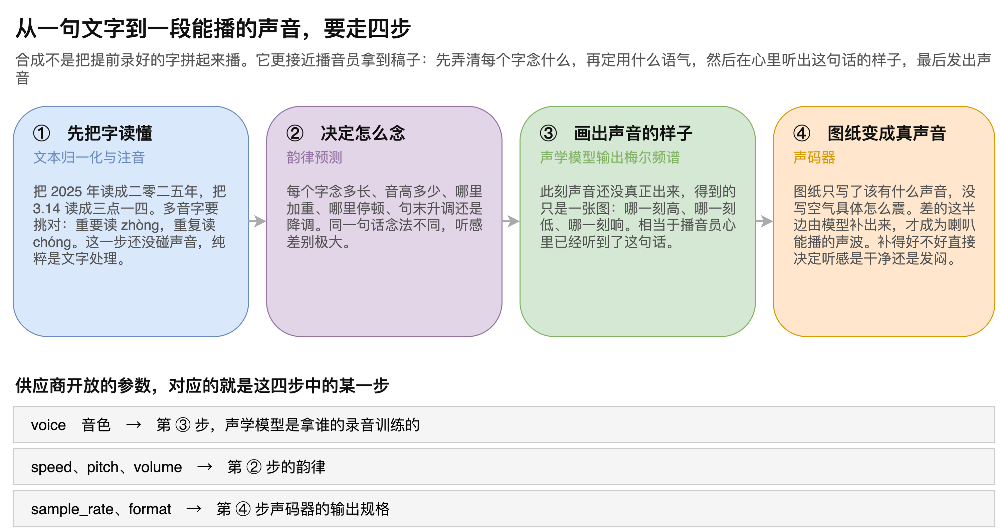
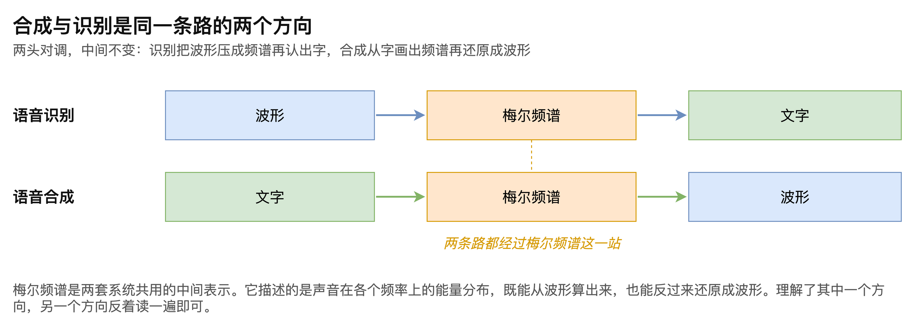
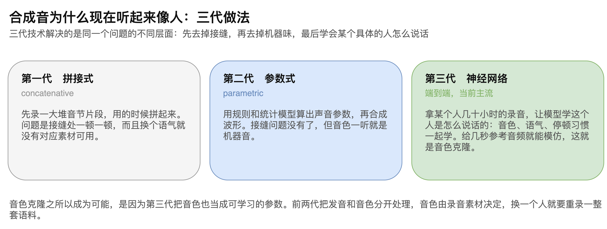
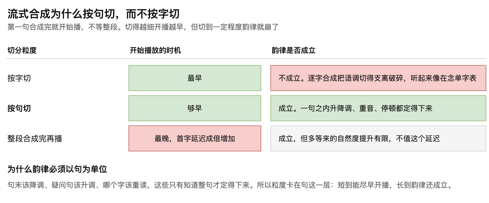

# 第06章 文字转语音的 TTS 原理

早年的机器朗读，一听就知道不是人：字与字之间顿挫生硬，语调平得像念清单。如今的语音助手读同一段文字，抑扬顿挫已经接近真人，甚至能模仿某个特定的人说话。这中间发生的变化，不在于录了更多的音，而在于合成的做法换了代。

把一句文字变成声音，机器走的四步与播音员拿到稿子后的动作高度一致：先弄清每个字念什么，再定用什么语气，然后在心里听出这句话的样子，最后发出声音。

本章依次拆开这四步，说明每一步在解决什么问题；再指出合成与识别其实是同一条路的两个方向；然后梳理三代合成技术各自解决了什么；最后说明流式合成为什么以句为切分单位。读完本章，读者将能说清一段文字变成声音的完整过程，也能理解识别服务开放的那几个参数分别作用在哪一步。

## 6.1 从文字到声音的四个步骤

一句话的合成过程“如图6-1”所示。

### 6.1.1 文本归一化与注音

第一步要把字读懂，这一步完全不碰声音，是纯粹的文字处理。

它包含两件事。一是文本归一化，把书面写法转成读法：2025 年要读成二零二五年，3.14 要读成三点一四。二是注音，为每个字确定读音，这里的难点是多音字，重要读 zhòng，重复读 chóng，选错读音后面全错。

> 注意：多音字和数字读法是合成出错最集中的地方，接入后应优先用业务中的真实文案做一轮抽查。

### 6.1.2 韵律预测

第二步决定怎么念，这一步称为韵律预测。

它要确定的内容包括：每个字念多长、音高多少、哪里加重、哪里停顿、句末是升调还是降调。

同样一句“你好吗”，念法不同，听起来可以差出很远。人说话本来就有抑扬顿挫，句末抬高还是压低，传达的语气完全不同。这一步做得好不好，直接决定合成音听起来像人还是像机器。

### 6.1.3 声学模型输出频谱

第三步由声学模型完成，产出的是梅尔频谱。

需要强调的是，走完这一步声音仍然没有真正出现。得到的只是一张描述这句话长什么样的图：哪一刻高、哪一刻低、哪一刻响。相当于播音员心里已经听到了这句话，但还没张嘴。

### 6.1.4 声码器还原波形

第四步把频谱还原成真正的声波，承担这项工作的模块称为声码器。

频谱这张图纸只写了该有什么声音，没有写空气具体怎么震动。差的这半边信息由模型补出来，补完才是喇叭能播放的波形。补得好不好，直接决定听感是干净还是发闷。

> 注意：合成音发闷、有金属感这类问题通常出在声码器环节，与前三步的文本处理和韵律无关，调整语速语调不会改善。

### 6.1.5 供应商参数与四步的对应

识别服务开放的那几个参数，其实分别落在这四步上，理解了四步就知道每个参数在调什么。

voice 参数选的是音色，对应第三步，决定声学模型是拿谁的录音训练出来的。speed、pitch、volume 三个参数对应第二步的韵律。sample_rate 和 format 对应第四步，规定声码器输出的规格。

## 6.2 合成与识别的对称关系

理解语音合成有一条捷径：它与语音识别是同一条路的两个方向，“如图6-2”所示。

语音识别的顺序是波形到梅尔频谱再到文字：先把声音压成频谱，再从频谱认出字。

语音合成的顺序正好倒过来，文字到梅尔频谱再到波形：先从字画出频谱，再把频谱还原成声音。

两头对调，中间那一站不变。梅尔频谱是两套系统共用的中间表示，它描述声音在各个频率上的能量分布，既能从波形算出来，也能反过来还原成波形。

> 注意：这种对称性只在数据表示层面成立，两个方向的模型并不能互换使用，各自需要单独训练。

## 6.3 三代合成技术

合成音听起来越来越像人，是三代技术逐步解决不同层面问题的结果，“如图6-3”所示。

### 6.3.1 拼接式

第一代的做法是先录一大堆音节片段，用的时候按需拼起来。

问题出在接缝。片段与片段之间衔接不上，听起来一顿一顿。而且换个语气就没有对应的素材可用，因为录制时只覆盖了有限的几种念法。早年那种明显机械感的朗读，多半来自这一代。

### 6.3.2 参数式

第二代改用规则和统计模型算出声音参数，再据此合成波形。

接缝问题消失了，语流变得连贯。但音色一听就知道是机器，缺少真人声音里的那些细微变化。

### 6.3.3 神经网络与音色克隆

第三代是端到端的神经网络方案，也是当前的主流。

它的做法是拿某个人几十小时的录音，让模型学这个人是怎么说话的。音色、语气、停顿习惯一起学，不再把发音和音色拆开处理。

正因为音色也变成了可学习的参数，音色克隆才成为可能：给模型几秒到几十秒的参考音频，它就能模仿这个人的声音说出任意文字。MiniMax、ElevenLabs 等服务提供的声音克隆功能，用的正是这一代技术。

前两代做不到这件事，因为在它们的框架里音色由录音素材决定，换一个人就要重新录制一整套语料。

## 6.4 流式合成与传输

### 6.4.1 按句切分的理由

在实时对话中，合成必须是流式的：第一句合成完就开始播，不等整段写完。这是首字延迟能压下来的关键。

既然切得越细开播越早，为什么不干脆按字合成？各种粒度的取舍“如图6-4”所示。

答案在于韵律要靠上下文。句末该降调、疑问句该升调、哪个字该重读，这些只有知道整句才定得下来。

举例来说，“今天我很开心，我一定要去打乒乓球”这句话，最后半句的语调要往上提。模型只有看到前面那半句，才知道这是一件值得高兴的事，语调该怎么走。若逐字合成，每个字都是孤立的，语调会被切得支离破碎，听起来像在念单字表。

所以粒度卡在句这一层：短到能尽早开播，长到韵律还成立。这也是实现中要攒够一句话才送去合成的原因。

> 注意：切句规则直接影响首字延迟，让第一句尽量短是一项几乎没有代价的优化，收益立竿见影。

### 6.4.2 音频与文字走不同的通道

合成完成之后，音频需要送回用户端播放。同时，识别到的文字和模型生成的回复文字通常也要显示在屏幕上。

这两类数据的传输要求不同。音频对实时性和抗丢包的要求高，一般走 WebRTC。文字则是普通的小体积消息，可选的方案很多，WebSocket、DataChannel、gRPC 乃至服务器发送事件（Server-Sent Events，SSE）都能承担。

选哪一种取决于项目已有的技术栈。如果音频已经走了 WebRTC，复用同一条连接上的 DataChannel 传文字可以省掉一套独立连接；如果前端本来就有 WebSocket 通道，直接复用也无不可。

> 注意：文字通道的选择不影响音频的实时性，两者相互独立，不必为了统一而把音频塞进同一条消息通道。

至此，语音合成的完整路径已经交代清楚：文本归一化与注音把字读懂，韵律预测定下怎么念，声学模型画出频谱，声码器还原成波形。这条路与语音识别方向相反而中途相同，都经过梅尔频谱这一站。合成音之所以越来越像人，来自神经网络方案把音色一并纳入学习；而实时对话中之所以以句为单位切分，是因为韵律这件事在一个字的尺度上根本无从谈起。
