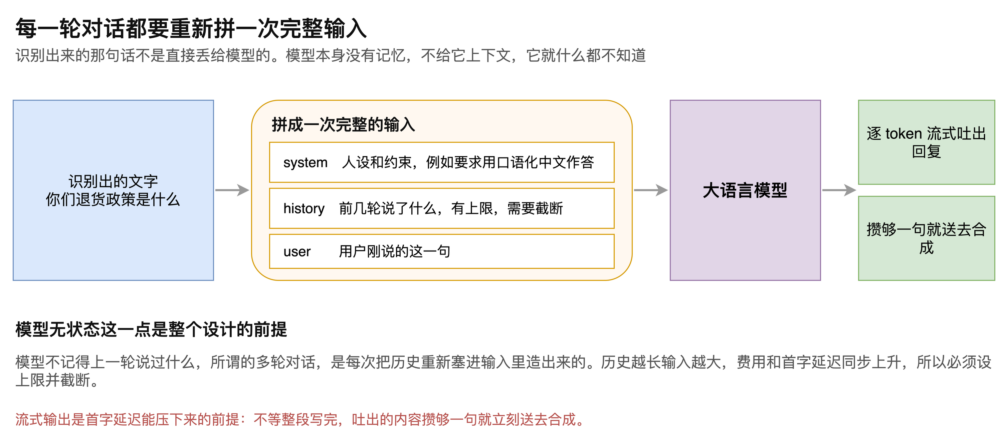
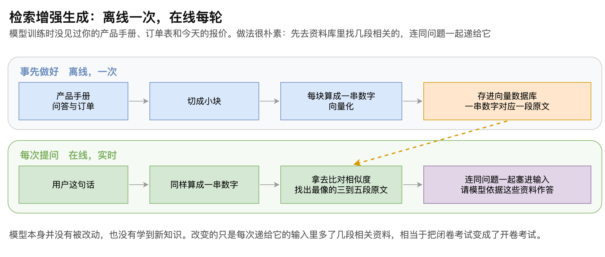

# 第07章 LLM 与 RAG 的基本原理

一套系统能听会说，还不足以称为智能体。把语音识别和语音合成直接接在一起，得到的只是一个复读机。让它成为 Agent 的，是中间那个负责决定说什么的环节。

但这个环节有两个容易被忽略的性质。一是它没有记忆：所谓的多轮对话，其实是每一轮都把历史重新塞进输入里造出来的。二是它不知道你公司的事：产品手册、订单数据、今天的报价，这些在它训练时都不存在，问到就只能答非所问。

本章先拆开每一轮对话的输入是怎么拼出来的，说明模型无状态这一点如何影响成本与延迟；再介绍检索增强生成如何让模型用上私有资料。读完本章，读者将能说清一句识别出来的文字要经过哪些加工才递到模型手里，也能判断什么样的业务需要引入检索。

## 7.1 智能体中的模型环节

### 7.1.1 智能来自哪里

把一套语音系统称为智能体，依据是链路中接入了大语言模型（Large Language Model，LLM）。语音识别负责听见，语音合成负责说出，而决定说什么这件事由模型完成。

这个组合的价值在硬件场景下尤其直观。一台机器人本身不会听也不会说，更不知道该做什么。接上这样一套系统，相当于同时补齐了耳朵、嘴和大脑，人可以直接用自然语言指挥它。

> 注意：智能体的能力上限由所接入的模型决定，链路其余环节只影响交互体验，不改变回答的质量。

### 7.1.2 每一轮都要重新拼一次输入

识别出来的那句话不会被直接送进模型。每一轮都要重新组装一份完整的输入，“如图7-1”所示。

这份输入通常由三部分构成。

system 部分是人设和约束，用来规定模型该以什么身份、什么风格作答。在语音场景下这一段尤其重要，需要明确要求用口语化中文、不要输出列表和标题，否则合成出来的语音会把项目符号一并念出来。

history 部分是前几轮的对话内容。它必须设上限并截断，原因下面说明。

user 部分是用户刚说的这一句。

组装这件事有现成的工具可用，各类提示词模板框架提供的正是这个能力：定义好模板，每轮把变动的部分填进去。

### 7.1.3 模型无状态带来的两个后果

模型本身不记得上一轮说过什么。多轮对话的连贯感，完全依靠每次把历史重新递进去。

这一点带来两个直接后果。

第一是成本随对话长度增长。历史越长，每轮输入的规模越大，计费也随之上升。

第二是延迟随对话长度增长。输入变长，模型读完这些内容再产出第一个词元的时间也会变长，直接体现在首字延迟上。

因此历史必须有上限。常见做法是只保留最近若干轮，更精细的做法是按词元数截断，超出就丢弃最早的内容。

> 注意：历史截断要保证 system 部分不被丢弃，否则模型会在对话进行到一定长度后突然忘记自己的人设。

### 7.1.4 流式输出

模型的回复采用流式返回，逐个词元吐出，而不是等整段生成完毕再一次性给出。

这是首字延迟能够压缩的前提。系统持续接收吐出的内容，攒够一个完整句子就立刻送去合成，不等后面的内容。

## 7.2 让模型用上私有资料

### 7.2.1 模型不知道你公司的事

设想一个用于电商客服的语音智能体。用户问“你们的退货政策是什么”，或者问某款笔记本电脑的具体参数。

模型训练时并没有见过这家公司的产品手册、订单表和价格。面对这类问题，它要么泛泛而谈，要么干脆答非所问。明明公司有这款产品，系统却推荐不出来。

这不是模型能力不足，而是它确实不掌握这部分信息。

### 7.2.2 检索增强生成的做法

解决办法称为检索增强生成（Retrieval-Augmented Generation，RAG）。它的思路很朴素：先去资料库里找出几段相关的内容，连同问题一起递给模型。

整个过程分为两条线，“如图7-2”所示。

第一条线是离线做的，通常只做一次。把产品手册、常见问答、订单数据这些资料切成小块，每一块计算成一串数字，这个过程称为向量化。得到的数字连同对应的原文一起存进向量数据库。

第二条线是在线做的，每次提问都要走一遍。把用户这句话用同样的方式算成一串数字，拿去和数据库里的向量比对相似度，找出最接近的三到五段原文，把它们连同问题一起塞进递给模型的输入里。

### 7.2.3 模型并没有被改动

有一点需要说清楚：引入检索之后，模型本身没有任何变化，也没有学到新知识。

改变的只是每次递给它的输入。原先它面对的是一道闭卷题，现在输入里多了几段相关资料，变成了开卷题。它依然只是在读输入、写回复。

理解这一点很重要，因为它决定了检索的效果上限：如果检索出来的资料不相关，模型也答不好；反过来，如果资料准确，即使是能力一般的模型也能给出正确答案。

> 注意：回答不准时应先检查检索出来的内容是否相关，更换更强的模型往往解决不了检索环节的问题。

### 7.2.4 把用户问过的问题存起来

除了预先准备的资料，用户实际问过的问题和对应的回答也可以存进向量数据库。

这样做的效果是：同类问题被再次问到时，系统能检索到上一次的问答记录，回答得更快也更一致。积累得越久，对这个用户和这类业务的贴合度越高。

> 注意：把用户对话存入向量库涉及个人信息，需要明确留存期限与删除机制，不能只考虑效果而忽略合规。

## 7.3 选型上的两个判断

理解了上述机制，选型时的两个判断也就清楚了。

第一个判断是模型接入。链路对模型的要求是流式输出和合理的首字延迟，接口形态上大多数平台都提供兼容 Chat Completions 的端点，DeepSeek、Kimi、通义等都可以接入。需要避开的是思考类模型，它们在给出答案前会先输出一大段推理过程，在语音场景下就是用户干等。

第二个判断是要不要上检索。如果业务问答只涉及通用常识，不引入检索也能工作；一旦涉及本企业的产品、订单、政策这类模型不可能知道的内容，检索就是必需的，否则回答的准确率无从保证。

> 注意：选型时要实测首个词元返回的时间，而不是只看整段回复的耗时。语音场景下用户感知到的是前者，两个指标在不同平台上的差距可能很大。

至此，模型环节的两件事已经交代清楚：每一轮对话的输入都是重新拼出来的，模型无状态这一性质同时决定了成本和延迟必须靠截断历史来控制；而让模型用上私有资料靠的不是重新训练，而是在输入里附上检索到的相关片段。这两件事合起来，才让一套能听会说的系统真正具备解决具体业务问题的能力。
