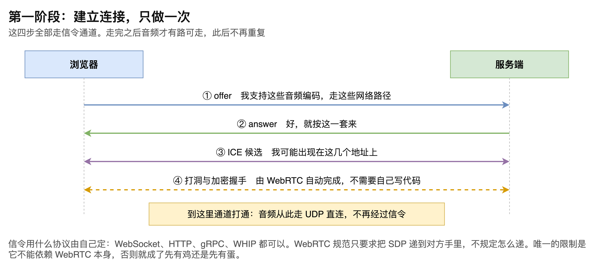
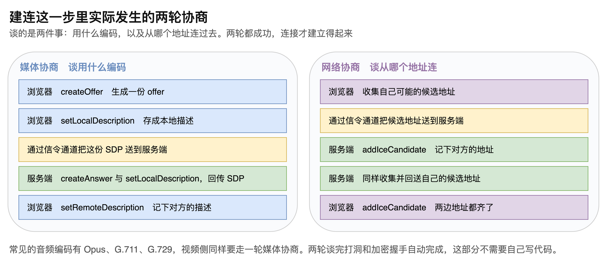
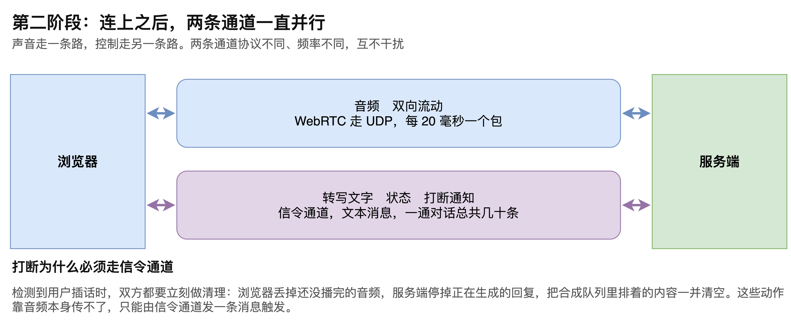
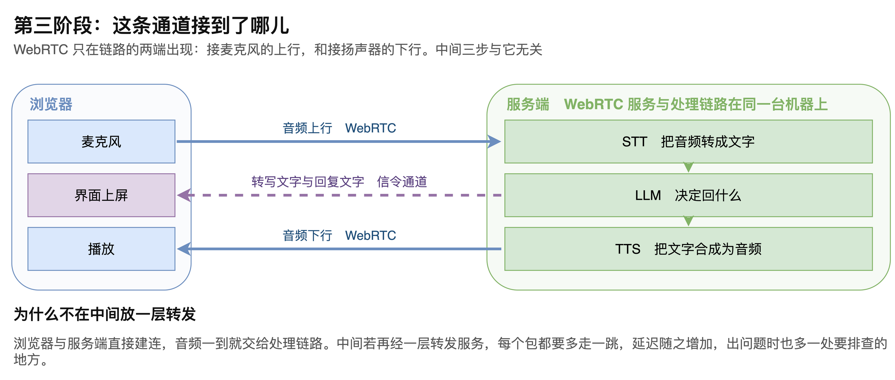

# 第08章 WebRTC 在 VoiceAgent 中的基本流程

声音要从用户的麦克风送到服务端，服务端合成好的回复要送回用户的扬声器，这两件事都绕不开 WebRTC。它已经是浏览器里做实时音视频的既定标准，在现代浏览器中无须安装任何插件即可使用。

但对一套语音智能体来说，WebRTC 并不承担全部工作。它只出现在链路的两端：接麦克风的上行和接扬声器的下行。中间的识别、生成、合成三步与它无关。理清这条边界，才知道延迟究竟出在哪一段，出问题时该查哪里。

本章把这条通道拆成三个阶段来看：建立连接时双方交换了什么，连上之后有哪几条通道在跑，以及这条通道最终接到了链路的哪个位置。读完本章，读者将能说清一次通话从建连到出声的完整走向，也能理解为什么建议把传输与处理放在同一侧。

## 8.1 第一阶段：建立连接

### 8.1.1 四步交换

建立连接这件事只做一次，通话期间不再重复。它由四步交换构成，“如图8-1”所示。

第一步，浏览器发出 offer，内容是自己支持哪些音频编码、可以走哪些网络路径。

第二步，服务端回 answer，表示按这一套来。

第三步，双方交换 ICE 候选，也就是各自可能出现的网络地址。

第四步，打洞与加密握手，这一步由 WebRTC 自动完成，不需要自己写代码。

四步走完，通道就打通了。此后音频走 UDP 直连，不再经过这条交换通道。

### 8.1.2 谈的其实是两件事

上述四步在规范里对应两轮协商，各自谈一件事，“如图8-2”所示。

媒体协商谈的是用什么编码。浏览器先调用 createOffer 生成一份 offer，再用 setLocalDescription 把它存成本地描述，然后通过信令通道送到服务端。服务端调用 createAnswer 并同样存成本地描述，把结果回传。浏览器收到后调用 setRemoteDescription 记下对方的描述。这一轮走完，双方就谈妥了用哪种编码，常见的选项有 Opus、G.711、G.729。视频侧走的是同一套流程。

网络协商谈的是从哪个地址连过去。双方各自收集自己可能的候选地址，通过信令通道发给对方，对方调用 addIceCandidate 记下来。两边的地址都齐了，这一轮才算完成。

两轮都成功，连接才真正建立。任何一轮谈不拢，后面的音频就无从谈起。

> 注意：连不上时应先分清是哪一轮出了问题。收不到 answer 属于媒体协商失败，双方地址都齐了却仍然不通则属于网络协商失败，两者的排查方向完全不同。

### 8.1.3 信令协议由自己定

前面反复出现的信令通道，指的是承载 offer、answer 和候选地址的那条路。

WebRTC 规范刻意不规定这条路用什么协议。WebSocket、HTTP、gRPC、WHIP 都可以，自己定一套也可以。规范只要求把 SDP 递到对方手里，至于怎么递是实现者的事。这是它最灵活、也最容易让初学者困惑的一点。

唯一的硬性限制是这条路不能依赖 WebRTC 本身。用 DataChannel 传 offer 和 answer 是行不通的，因为 DataChannel 自己就要靠 offer 和 answer 才建得起来，这构成了先有鸡还是先有蛋的循环。

## 8.2 第二阶段：连上之后

### 8.2.1 两条通道并行

连接建立之后，有两条通道同时在跑，“如图8-3”所示。

一条是音频通道，走 WebRTC，底层是 UDP，双向流动。它的特点是高频且持续：每 20 毫秒一个包，每秒 50 个，只要通话没结束就一直在传。

另一条是信令通道，传的是文本消息。它的特点正相反：低频、体积小，一通对话总共也就几十条消息。

两条通道协议不同、端口不同，甚至可以落在不同的服务器上，彼此互不干扰。

> 注意：信令断开与通话断开是两回事。媒体走的是另一条 UDP 直连，信令掉线后音频往往还能流一段时间。要么明确把信令断开当作挂断信号，要么给两条通道各自加心跳分别判断，含糊处理会出现界面已经断开而耳朵里还在说话的情形。

### 8.2.2 信令通道承担的消息

信令通道在通话期间主要传三类消息。

第一类是转写文字。识别服务产出文字后，需要显示在界面上，这部分内容通过信令通道送到前端。模型生成的回复文字同理，合成语音在播放的同时，对应的文字也要上屏。

第二类是会话状态，比如正在听、正在思考、正在说。声音本身不携带这些信息，只听音频前端无从判断当前是模型在思考还是网络卡住了。

第三类是打断通知，下面单独说明。

### 8.2.3 打断为什么必须走信令

检测到用户插话时，双方都要立刻做清理。

浏览器这一侧要丢掉缓冲里还没播完的音频，否则用户已经开口了，耳机里旧的回复还在继续说。服务端这一侧要停掉正在生成的回复，把合成队列里排着的内容一并清空，识别侧也要重新开始。

这些动作是控制指令，靠音频流本身传不了，只能由信令通道发一条消息触发。这就是为什么即使音频已经有了独立通道，仍然需要一条文本通道并行存在。

## 8.3 第三阶段：这条通道接到了哪儿

### 8.3.1 三段走向

把前两个阶段合起来看，整条链路的走向就清楚了，“如图8-4”所示。

第一段是音频上行。麦克风采集到的声音通过 WebRTC 送到服务端，交给语音识别。

第二段是服务端内部的处理。识别得到文字，模型据此生成回复，合成把回复变成音频。这三步都在服务端完成，与 WebRTC 无关。

第三段是音频下行。合成好的音频通过 WebRTC 送回浏览器播放。

与此并行的是文字的上屏：识别出的文字和模型回复的文字通过信令通道送到前端显示。

由此可以看出，WebRTC 在整条链路里只与识别和合成两端直接相邻。它决定的是声音传得快不快、稳不稳，不影响回答的内容。

> 注意：定位延迟问题时应先区分是传输段还是处理段。传输段的异常通常表现为卡顿、杂音、丢字，处理段的异常表现为响应整体变慢但音质正常，两者的优化手段没有交集。

### 8.3.2 不加中转层的理由

一种常见的做法是在浏览器与业务服务之间放一层转发服务，由它接收音频再转给后端。在多人会议场景下这是必要的，因为需要有地方做混流和分发。

但在语音智能体这个场景里，通话双方只有用户和服务端两个端点，中转层带来的只有代价。每个音频包都要多走一跳，延迟随之增加；出问题时也多一处需要排查的地方；整体复杂度上升，收益却接近于零。

因此推荐的做法是让浏览器与服务端直接建立连接，并且把 WebRTC 服务端与识别、生成、合成放在同一侧。音频一进来就能交给处理链路，省掉中间的往返。

这样安排还有一个附带好处：打断发生时，需要清理的几个环节都在同一进程里，通知一到就能同步停掉，不必跨服务协调。

至此，WebRTC 在这套系统里的位置已经清楚：建连阶段通过两轮协商谈妥编码与地址，这一步只做一次；连上之后音频与信令两条通道并行，前者高频持续，后者低频但不可或缺；整条链路上 WebRTC 只负责两端的传输，中间三步与它无关。理解了这条边界，延迟出在哪一段、故障该往哪个方向查，都有了明确的判断依据。
