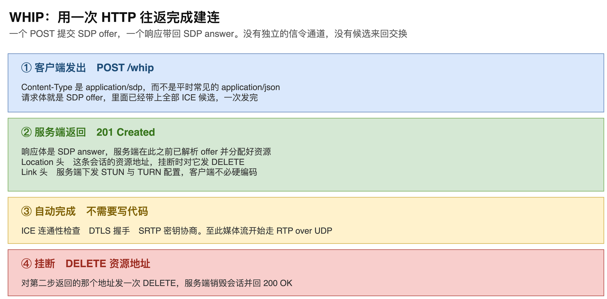
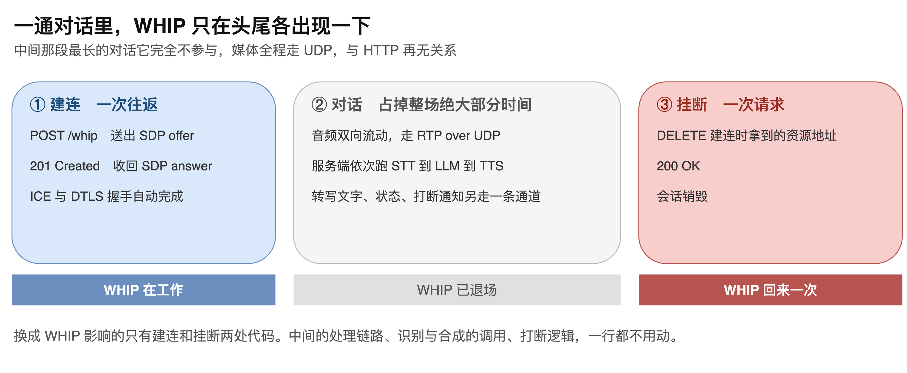
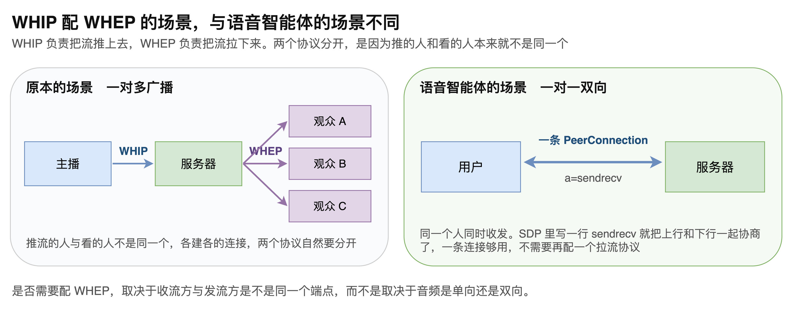
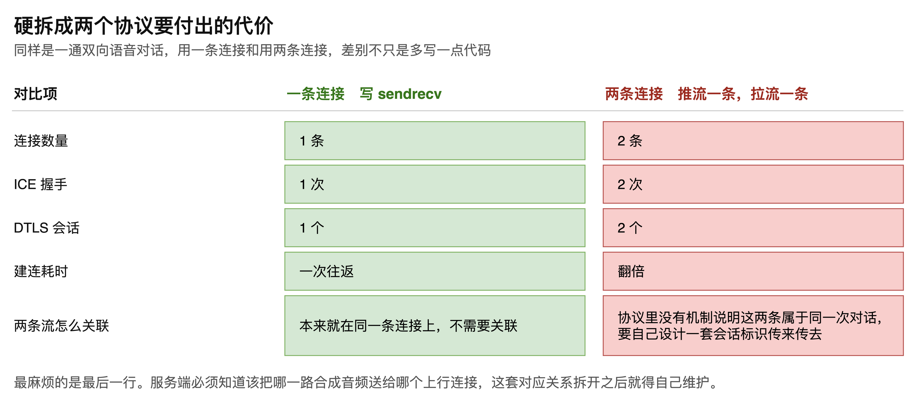

# 第09章 WHIP 协议详解

WebRTC 建立连接需要交换 SDP 和候选地址，但规范刻意没有规定用什么协议来交换。于是每个项目都要自己搭一套信令：开一条 WebSocket，定义消息格式，处理重连，再在服务端维护一份会话状态。这些代码与业务无关，却是每个项目都绕不开的。

WHIP 解决的正是这件事。它把整个建连过程压缩成一次 HTTP 往返：一个 POST 把 SDP offer 发上去，响应里带回 SDP answer，连接就建好了。没有独立的信令通道，没有候选来回交换，也不需要维护一条长连接。

本章拆开这个协议的三次交互，说明它省掉了什么、代价是什么；再说明它在一通对话里的活跃期只有头尾两处；最后回答一个常被问到的问题：既然有配套的拉流协议 WHEP，为什么语音智能体只用一个 WHIP 就够了。读完本章，读者将能判断自己的项目适不适合用 WHIP 替换现有的信令实现。

## 9.1 一次 HTTP 往返完成建连

### 9.1.1 三次交互

整个协议的交互过程“如图9-1”所示。

第一次交互是客户端发出的 POST 请求。这个请求有一处值得留意：Content-Type 是 application/sdp，而不是做应用开发时常见的 application/json。这说明 WHIP 是专为 WebRTC 的信令交换设计的，请求体直接就是 SDP offer，不需要再包一层 JSON 结构。

第二次交互是服务端的响应。服务端解析 offer、生成 answer、分配资源，然后返回 201 Created，响应体是 SDP answer。

到这里建连所需的交换就已经结束。接下来的 ICE 连通性检查、DTLS 握手、SRTP 密钥协商全部自动完成，不需要写代码，完成后媒体流开始走 RTP over UDP。

第三次交互发生在挂断时，客户端对第二步返回的资源地址发一次 DELETE，服务端销毁会话并回 200 OK。

整个过程看起来与做一个普通的增删改查接口没有区别，这正是它的价值所在。

### 9.1.2 两个响应头是关键

201 响应里有两个头值得单独说明。

Location 头给出这条会话的资源地址，形如 /whip/{resource-id}。这个地址是挂断时 DELETE 的目标，客户端需要保存下来。

Link 头由服务端下发 STUN 与 TURN 的配置。这一点在工程上很实用：客户端不必把打洞服务器的地址硬编码在代码里，换服务器时只改服务端即可。

> 注意：Location 返回的地址必须保存，否则挂断时找不到要销毁的会话，服务端只能靠超时回收，资源会积压。

### 9.1.3 省掉了什么，代价是什么

之所以只要一次往返，是因为 offer 里已经带上了全部 ICE 候选，一次发完。

对照常规做法：候选是边收集边发的，客户端每发现一个候选就立刻发给对方，对方随收随加，双方的地址逐步凑齐，直到网络打通为止。这种做法的好处是不必等待，候选出来一个就用一个。

WHIP 反过来，把所有候选收集完再发出这个 POST。代价就是要等这个收集过程结束，建连的起步时刻被推后一点。

这笔交易在语音智能体场景下是划算的：换来的是没有长连接要维护，没有消息格式要定义，没有重连逻辑要写。

> 注意：候选收集在网络环境差时耗时会明显变长，这部分等待直接计入建连耗时。如果对建连速度有严格要求，需要给收集过程设一个上限。

## 9.2 WHIP 在一通对话里的位置

### 9.2.1 只在头尾出现

把建连、对话、挂断三段并排来看，WHIP 的活跃期就很清楚了，“如图9-2”所示。

第一段是建连，一次往返，耗时通常在几百毫秒。这一段 WHIP 在工作。

第二段是对话，占掉整场通话绝大部分时间。音频双向流动走 RTP over UDP，服务端依次跑识别、生成、合成，转写文字与状态通知另走一条通道。这一段 WHIP 完全不参与。

第三段是挂断，一次 DELETE 请求。这一段 WHIP 回来一次。

因此把现有信令换成 WHIP，影响的只有建连和挂断两处代码。处理链路、识别与合成的调用、打断逻辑，一行都不用动。这也意味着这项改造的风险是可控的。

### 9.2.2 应用层消息要另找出路

WHIP 只管媒体，协议里没有给应用层事件留位置。

转写文字、会话状态、打断通知这些消息，在 WHIP 里没有对应的表达方式。所以要么另开一条 WebSocket，要么把它们挪到 DataChannel 上。

这两种方案的差别在于连接数。既然 WebRTC 连接已经建立起来了，它本身就带有 DataChannel，直接用它传这些消息，可以省掉一条独立的长连接，也省掉一套独立的重连处理。反过来，如果前端本来就有 WebSocket 通道在用，复用它也无不可。

> 注意：把应用层消息挪到 DataChannel 上之后，信令与媒体的生命周期就绑定在一起了。连接断开时两者同时消失，好处是状态一致，代价是失去了独立判断的能力。

### 9.2.3 严格说它是摄取协议

还有一点需要说明：WHIP 的设计目标是客户端向服务端单向推流，字面意义上是摄取。

语音智能体要的是双向音频。做法是在 SDP 里写 sendrecv，这样上行和下行一起协商，跑得通。但这属于借用它的形态，而不是严格遵守它的原始语义。

实践中这不构成问题，因为目的很明确：用的协议越少越好，不必为了语义上的严谨去多维护一套东西。

## 9.3 为什么不配一个 WHEP

### 9.3.1 两种场景的差别

WHIP 有一个配套协议叫 WHEP，负责把流拉下来。二者的关系类似直播里的推流与播放：主播用一个协议把流推到服务器，观众用另一个协议从服务器把流拉走。

这两个场景的结构差别“如图9-3”所示。

广播场景下，推流的人和看的人不是同一个。主播只推不收，观众只收不推，各建各的连接，两个协议自然要分开。

语音智能体的场景是一对一双向。用户既说也听，服务端既收也发，两端都是同一个人对同一个服务。SDP 里写一行 sendrecv，一条 PeerConnection 就把上行和下行都协商了，不需要再配一个拉流协议。

由此可以得出一个判断依据：是否需要配 WHEP，取决于收流方与发流方是不是同一个端点，而不是取决于音频是单向还是双向。

### 9.3.2 硬拆开的代价

如果坚持按协议原意拆成推流和拉流两条连接，代价“如图9-4”所示。

前四项是量上的翻倍：两条 PeerConnection、两次 ICE 握手、两个 DTLS 会话、建连耗时翻倍。这些虽然不划算，但至少是可以估算的。

真正麻烦的是最后一项。WHIP 和 WHEP 之间没有任何机制能表达这两条流属于同一个用户、同一次对话。服务端必须知道该把哪一路合成音频送给哪个上行连接，而协议不提供这个信息，只能自己设计一套会话标识在两条链路之间传来传去。

这套对应关系一旦拆开就得自己维护，出问题时排查也更费劲。相比之下，一条连接本来就在同一个上下文里，这个问题根本不存在。

> 注意：判断要不要引入第二个协议，先看它是否带来了必须自己补齐的关联关系。需要额外维护标识才能把两半拼回去的方案，通常说明拆分方向选错了。

至此，WHIP 的全貌已经清楚：它用一次 HTTP 往返换掉了一整套信令实现，代价是要等候选收集完；它在一通对话里只出现在建连和挂断两处，中间最长的对话段完全不参与；它不管应用层消息，这部分要靠 DataChannel 或独立通道补上；而在一对一双向的场景里，一条写了 sendrecv 的连接就够用，配上 WHEP 只会平添一套要自己维护的对应关系。
