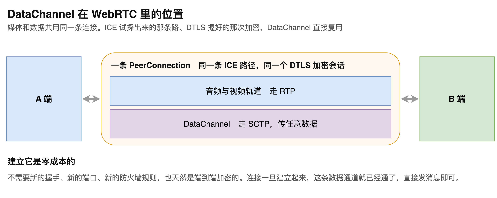
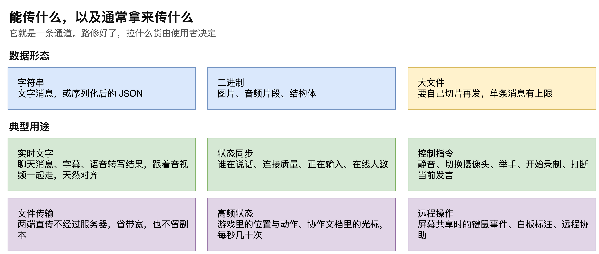
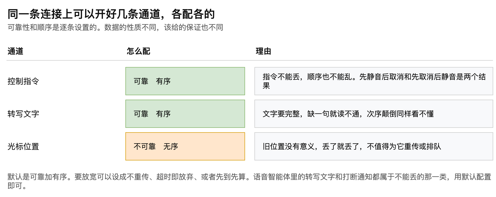
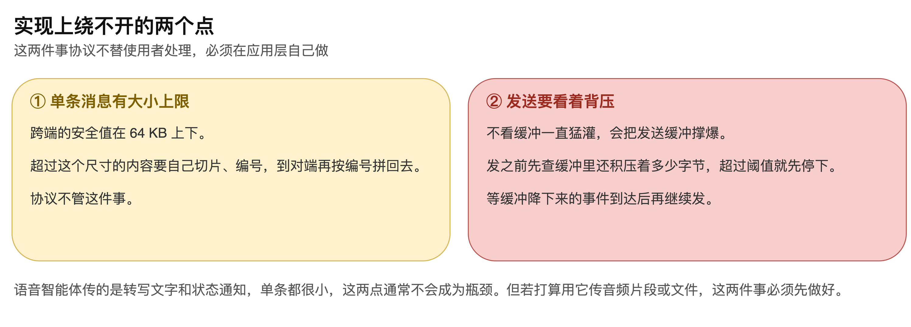

# 第10章 DataChannel 数据传输

WebRTC 常被当成音视频通话技术，这个印象只对了一半。它同时还是一条端到端加密、低延迟的通用数据管道，这一半的能力叫 DataChannel。

对语音智能体来说，这半边能力直接影响架构的简洁程度。识别出的文字要送到前端显示，会话状态要同步，打断发生时要通知对方做清理，这些都是文本消息。常规做法是另开一条 WebSocket 来传，但既然音频连接已经建立起来了，这些消息完全可以走同一条连接。

本章说明 DataChannel 在连接里处于什么位置、能传什么、多条通道如何按数据性质分别配置，以及实现上绕不开的两个限制。读完本章，读者将能判断自己的项目是否可以去掉那条独立的文本连接。

## 10.1 它在连接里的位置

### 10.1.1 媒体与数据共用一条路

一条连接上，媒体和数据是并存的，“如图10-1”所示。

两端之间只有一条 PeerConnection。音频与视频轨道走 RTP，DataChannel 走 SCTP，传任意数据。两者共用同一条 ICE 试探出来的网络路径，也共用同一次 DTLS 握手协商出来的加密。

### 10.1.2 建立它是零成本的

正因为共用，开启 DataChannel 不需要新的握手、新的端口、新的防火墙规则，也天然就是端到端加密的。

连接一旦建立，这条数据通道就已经通了，使用者只管发消息。

这一点解释了一个常见的架构简化：当建连已经由 WHIP 这类协议完成之后，项目里那条专门用来传文字的 WebSocket 就不再是必需的，应用层消息可以直接落到 DataChannel 上。整套系统的外部依赖因此少一个。

> 注意：这项简化的代价是信令与媒体的生命周期绑定在一起。连接断开时两者同时消失，界面与音频的状态不会再出现一边断一边还在的情况，但也失去了分别判断的能力。

## 10.2 能传什么

### 10.2.1 三种数据形态与常见用途

它本质上就是一条通道，路修好了，拉什么货由使用者决定。常见的数据形态与用途“如图10-2”所示。

数据形态有三类。字符串可以是一条文字消息，也可以是序列化之后的 JSON。二进制可以是图片、音频片段或者结构体。大文件也能传，但要自己切片，原因见本章最后一节。

### 10.2.2 六种典型用途

实时文字是最直接的一类，聊天消息、字幕、语音转写结果都属于此。它们跟着音视频一起走，时间上天然对齐。

状态同步用来告诉对方此刻发生了什么，比如谁在说话、连接质量如何、对方是否正在输入、当前在线多少人。开会和直播场景里这类信息很实用。

控制指令包括静音、切换摄像头、举手、开始录制、打断当前发言。

文件传输是两端直传，不经过服务器。对于点对点的应用来说，这既省了服务器带宽，也不会在服务器上留下副本。

高频状态指的是游戏里的位置与动作、协作文档里的光标位置这一类数据，频率可以达到每秒几十次。多人协作的白板上看到别人的鼠标在移动，靠的正是这条通道。

远程操作包括屏幕共享时的键鼠事件、白板标注、远程协助。

> 注意：文件两端直传省的是服务器带宽，但也意味着服务端没有这份内容的副本。需要留存或审计的场景不适合用这种方式。

## 10.3 多条通道各配各的

### 10.3.1 按数据性质分别设置

同一条连接上可以同时开好几条 DataChannel，每条按数据的性质单独配置可靠性和顺序，“如图10-3”所示。

控制指令这条要求可靠加有序。指令不能丢，顺序也不能乱，先静音后取消和先取消后静音是两个完全不同的结果。

转写文字这条同样要求可靠加有序。文字缺一句就读不通，次序颠倒同样看不懂。

光标位置这条则相反，可以设成不可靠、无序。旧的位置已经没有意义，丢了就丢了，不值得为它重传，更不该让它排在队列里拖慢后面的新位置。

### 10.3.2 可选的放宽方式

默认配置是可靠加有序。要放宽有几种方式：设成不重传，设成超过一定时间就放弃，或者设成先到先算不排队。

判断依据很简单：这条数据迟到之后还有没有用。有用就保留可靠与有序，没用就放宽，让新数据尽快通过。

> 注意：语音智能体里的转写文字和打断通知都属于不能丢的一类，用默认配置即可。不要为了追求低延迟把打断通知设成不可靠，一条丢失的打断通知会让用户听到自己已经打断掉的那句回复继续播完。

## 10.4 两个绕不开的限制

有两件事协议不替使用者处理，必须在应用层自己做，“如图10-4”所示。

第一件是单条消息的大小上限。跨端的安全值在 64 KB 上下，超过这个尺寸的内容要自己切片、编号，到对端再按编号拼回去。

第二件是发送时要看着背压。不看缓冲一直猛灌，会把发送缓冲撑爆。正确的做法是发之前先查缓冲里还积压着多少字节，超过阈值就先停下，等缓冲降下来的事件到达后再继续。

对语音智能体而言，传的都是转写文字和状态通知，单条消息都很小，这两点通常不会成为瓶颈。但若打算用它传音频片段或文件，这两件事必须先做好。

> 注意：这两个限制在本机联调时几乎不会暴露，因为本地带宽足够、往返极快。切片和背压的处理必须在真实网络下验证，否则问题会留到线上才出现。

至此，DataChannel 的作用就清楚了：它与音频共用同一条连接、同一次加密握手，开启它不增加任何连接成本；它能传字符串、二进制和切片后的大文件；多条通道可以按数据是否经得起丢失分别配置。对语音智能体来说，这意味着建连协议加上这条数据通道，就能同时承担音频传输和应用层消息两件事，系统的外部依赖可以再少一个。
