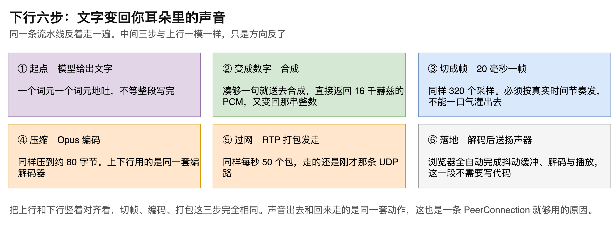
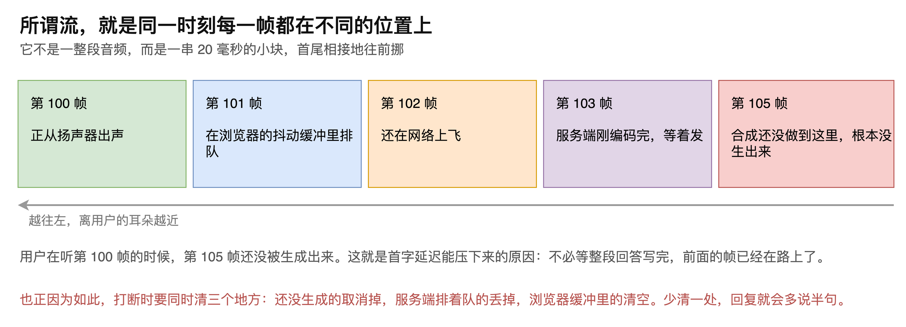

# 第11章 语音流走向详解

一段声音从用户嘴边出发，最终回到用户耳边，中间换了好几种形态：空气的振动、一串整数、压缩后的字节、网络上的数据包，然后再原路变回来。

这条路径上每一步在做什么，决定了工程实现中大量细节的取值。采样率该设多少、一帧多长、时间戳怎么递增、打断时该清哪几个地方，答案都在这条路径上。搞不清楚，就会出现声音忽快忽慢、打断之后还多说半句这类难以定位的问题。

本章沿着这段旅程走一遍：先看上行的六步，再看下行对称的六步；然后拎出三个从头到尾不变的数字；最后说明所谓的流究竟是什么形态，以及它为什么决定了打断必须清理三个地方。读完本章，读者将能凭这条路径解释链路上绝大多数参数的由来。

## 11.1 上行：声音变成文字

一段声音变成文字要经过六步，“如图11-1”所示。

### 11.1.1 从空气到一串整数

起点是说话本身。此时声音还只是声波，是空气在振动，不是数据。

麦克风采样把它变成数字：每秒量 16000 次，每次记下一个 16 位整数。这一串整数就是 PCM，也就是最原始的音频数据。所谓把音频数据发到服务端，发的正是这串整数。

### 11.1.2 切帧与压缩

接下来把这串整数切成帧，每帧 20 毫秒。按 16000 赫兹的采样率算，20 毫秒是 320 个采样，每个采样 2 字节，合 640 字节。整条链路都按这个节拍走。

帧长不是只能取 20 毫秒，30 毫秒也可以。取值背后的权衡在本章第三节说明。

切帧之后做压缩，用的是 Opus 编码。640 字节压到约 80 字节，小了 8 倍。丢掉的是人耳本来就听不出来的那部分，所以听感上感觉不到损失。

> 注意：压缩不是可选项。不压缩直接发，每秒的数据量会高出 8 倍，在移动网络下几乎跑不动。

### 11.1.3 打包与落地

压缩后的数据用 RTP 打包，加 12 字节包头，走 UDP 发出去。每秒 50 个包，只要在说话就不停歇。

到了服务端，先解码回 16000 赫兹的 PCM，再喂给识别模型，出文字。至此上行结束。

## 11.2 下行：文字变回声音

下行是同一条流水线反着走一遍，“如图11-2”所示。

### 11.2.1 边生成边合成

起点是模型给出文字。它一个词元一个词元地吐，不等整段写完。

合成这一步凑够一句就送去做，返回的直接是 16000 赫兹的 PCM，又变回那串整数。

### 11.2.2 中间三步与上行完全相同

接下来同样切成 20 毫秒一帧，同样 320 个采样；同样用 Opus 编码压到约 80 字节；同样用 RTP 打包，每秒 50 个包，走的还是刚才那条 UDP 路。

上下行用的是同一套编解码器，走的是同一条连接。

下行有一点与上行不同：发送必须按真实时间节奏进行，不能一口气把合成好的音频全灌出去。合成的速度往往快于播放的速度，灌过去只会把对端的缓冲撑满。

到了浏览器，抖动缓冲、解码、播放全自动完成，这一段不需要写代码。

> 注意：把上行和下行竖着对齐看，切帧、编码、打包这三步完全相同。声音出去和回来走的是同一套动作，只是方向反了，这也是一条 PeerConnection 就够用的原因。

## 11.3 三个贯穿全程的数字

链路上有三个数字从头到尾不变，“如图11-3”所示。记住它们，大部分参数就不用再查了。

### 11.3.1 采样率 16000 赫兹

麦克风、识别、合成、播放，整条链路一个采样率走到底。

坚持这一点的理由是每多一次重采样，就多一次失真和出错的机会。能不转就不转。

### 11.3.2 帧长 20 毫秒

这是整条链路的节拍。语音活动检测数它，RTP 发它，打断时要清理的也是它。

取 20 毫秒是两头权衡的结果。再小，12 字节的包头就快赶上数据本身了，传输效率明显下降；再大，延迟直接抬高，因为每一帧都要攒满才能发出。每秒 50 帧是行业默认值。

### 11.3.3 时间戳时钟 48000 赫兹

这个数字最容易出错，因为它与实际采样率无关。

Opus 规定，不管实际用多少采样率，RTP 时间戳的时钟恒定为 48000 赫兹。所以每帧时间戳递增的是 960，而不是按 16000 赫兹算出来的 320。

写成 320，声音就会忽快忽慢。这是这条链路上最经典的一个坑。

> 注意：遇到声音忽快忽慢、语速不对的问题，先查 RTP 时间戳的递增值是不是 960。这个问题不会报错，只会表现为听感异常，从日志里看不出来。

## 11.4 所谓的流是什么形态

### 11.4.1 同一时刻每一帧都在不同位置

流不是一整段音频，而是一串 20 毫秒的小块，首尾相接地往前挪。在任何一个瞬间，相邻的几帧分别处在链路的不同位置上，“如图11-4”所示。

第 100 帧正从扬声器出声，第 101 帧在浏览器的抖动缓冲里排队，第 102 帧还在网络上飞，第 103 帧服务端刚编码完等着发，而第 105 帧合成还没做到那里，根本没生出来。

整条链路像一条流水线：采集、编码、打包、发送、识别、生成、合成、再编码、再打包、再发送、解码、播放，各个环节同时在动，处理的是不同的帧。

### 11.4.2 首字延迟为什么能压下来

用户在听第 100 帧的时候，第 105 帧还没被生成出来。这正是首字延迟能压下来的原因：系统不必等整段回答写完再开始播，前面的帧已经在路上了。

反过来说，如果任何一个环节改成攒齐了再处理，这条流水线就断了，延迟会立刻回到整段生成所需的时间。

### 11.4.3 打断为什么要清三个地方

同一时刻帧分散在多处，这也直接解释了打断处理的复杂性。

用户插话时，需要同时清理三个地方：还没生成的要取消掉，服务端排着队等发的要丢掉，浏览器缓冲里的要清空。

少清一处，回复就会多说半句。清了浏览器缓冲却没取消服务端的生成，新的音频还会继续送过来；取消了生成却没清浏览器缓冲，已经到达的那几帧照样会播完。

> 注意：打断处理的正确性要靠三处同时清理来保证，缺一不可。测试时应专门验证在回复刚开始播、播到一半、快播完这三个时刻插话的表现，三者暴露的问题并不相同。

至此，一段声音的完整旅程已经走完：上行经过采样、切帧、压缩、打包四次形态转换到达识别，下行沿同样的四步反向回到耳朵。采样率、帧长、时间戳时钟这三个数字贯穿全程，其中时间戳时钟与采样率无关这一点最容易出错。而理解了流是一串小块首尾相接地流动，就能同时解释首字延迟为什么压得下来，以及打断为什么必须同时清理三个地方。
