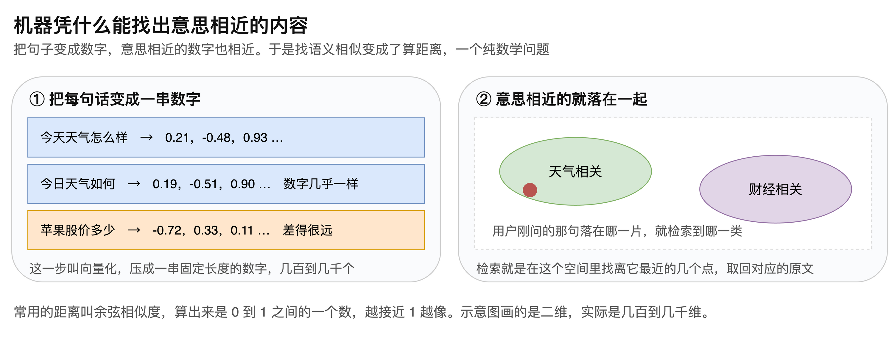
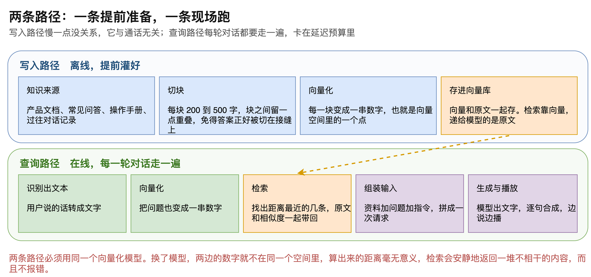
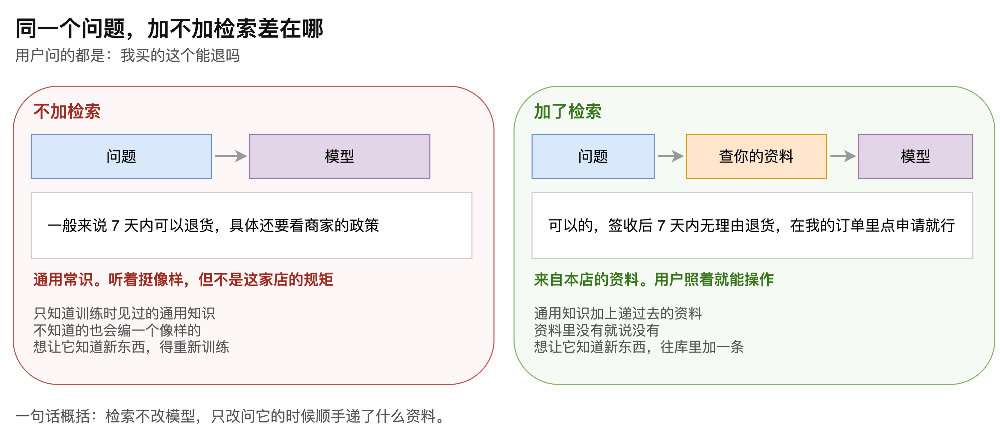

# 第12章 RAG 流程与原理详解

一套语音智能体能听会说、响应够快，仍然可能在最基本的问题上答不上来。用户问一句“我买的这个能退吗”，得到的却是一段听着挺像样、但与这家店无关的通用说法。

原因不在链路，而在模型。通用模型只知道训练时见过的东西，一家店的退货政策、一份产品手册、一批订单数据，它都没见过。想让它答得出这些，不是靠换更强的模型，而是靠在提问时把相关资料一并递过去。这个做法叫检索增强生成，简称 RAG。

本章从最底层的问题讲起：机器凭什么能找出意思相近的内容。然后说明写入与查询两条路径各自做什么、什么时候做，接着拆开递给模型的那份输入究竟由哪几段拼成，最后用同一个问题对比加与不加检索的实际差别。读完本章，读者将能判断自己的业务是否需要引入检索，也能避开其中最常见的一个坑。

## 12.1 原理：怎么找出意思相近的内容

### 12.1.1 把句子变成一串数字

一切的起点是向量化，也就是把一句话变成一串数字，“如图12-1”所示。

模型读懂整句话的意思，把它压成一串固定长度的数字，长度从几百到几千不等。

关键性质在于：意思相近的句子，数字也相近。“今天天气怎么样”和“今日天气如何”算出来的数字几乎一样，而“苹果股价多少”就差得很远。

这个性质把一个语义问题变成了数学问题。找语义相似不再需要理解语言，只需要算距离，而算距离极快。

### 12.1.2 意思相近的落在一起

把所有资料都算成数字之后，它们在空间里自然形成聚集。天气相关的挤在一片，财经相关的挤在另一片。苹果、梨、香蕉、草莓会靠在一起，笔记本、键盘、鼠标会靠在另一处，而草莓和笔记本之间距离很远。

用户刚问的那句话也算成数字，它落进哪一片，就检索到哪一类内容。

所谓检索出最相关的若干条，就是在这个空间里找离它最近的几个点，把对应的原文取回来。常用的距离叫余弦相似度，算出来是 0 到 1 之间的一个数，越接近 1 越像。

> 注意：图上画的是二维，实际的空间有几百到几千维，无法直观呈现。二维示意有助于理解聚集关系，但不要据此推断真实空间里的距离分布。

## 12.2 两条路径

引入检索之后，系统里多了两条路径，“如图12-2”所示。

### 12.2.1 写入路径

这条路径是离线的，提前灌好，与通话无关，慢一点没关系。

它的起点是知识来源：产品文档、常见问答、操作手册、过往对话记录。

第一步是切块，每块 200 到 500 字。块与块之间要留一点重叠，免得答案正好被切在接缝上，导致检索出来的片段缺了半句。

第二步是向量化，每一块变成一串数字，也就是空间里的一个点。

第三步是存进向量库。存的时候向量和原文一起存，因为检索靠向量，而递给模型的是原文。

两类内容都从这条路进去。一类是知识库，比如产品文档和常见问答，提前灌好，所有用户共享。另一类是对话记忆，也就是某个用户说过什么，边聊边存，只属于他自己。

### 12.2.2 查询路径

这条路径是在线的，每一轮对话都要走一遍，而且卡在延迟预算里。

流程是：识别出文本，把问题也向量化，检索出距离最近的几条并连原文和相似度一起带回，组装成一次完整的输入，交给模型生成，再逐句合成播出去。

> 注意：查询路径上的每一步都计入用户感知到的等待时间。向量化和检索通常各占几十毫秒，如果向量库部署在远端或者索引没建好，这两步很容易成为链路里最慢的一环。

### 12.2.3 两条路径必须用同一个向量化模型

这是实践中最常见的一个坑。

写入时用一个模型算向量，查询时换了另一个模型，两边的数字就不在同一个空间里，算出来的距离毫无意义。

麻烦之处在于它不报错。检索会安静地返回一堆不相干的内容，模型据此作答，结果看起来只是回答质量差，很难联想到是向量模型换了。

> 注意：更换向量化模型意味着整个向量库要重新构建，不能只改查询侧。把模型名称与库一起记录下来，是排查这类问题最省事的办法。

## 12.3 递给模型的那份输入

检索回来的资料不会直接就是答案，它要和别的内容拼成一份完整的输入。这份输入由三段构成，“如图12-3”所示。

第一段是人设与约束，规定模型该以什么身份、按什么规则作答。示例里写的是：你是产品客服，只根据下面的资料回答，资料里没有的就说不知道，不要编；回答控制在两三句话，用口语说，不要念文档。

第二段是检索回来的资料，通常带着相似度一起给出，相似度由高到低排列。

第三段是用户刚说的这一句。

这三段的顺序和措辞都会影响效果。其中“资料里没有的就说不知道”这一句尤其重要，它是防止模型一本正经地编造内容的关键约束。

在语音场景下还要额外加一条：要求用口语作答、不要输出列表和标题。否则合成出来的语音会把项目符号一并念出来，听感很奇怪。

> 注意：约束写在哪一段有讲究。把“只根据资料回答”放进人设段落，比混在资料里更稳定，因为它是一条始终生效的规则，不应随检索结果变动。

## 12.4 加与不加的实际差别

用同一个问题对比一下，差别就很直观，“如图12-4”所示。

不加检索时，问题直接给模型。它凭训练时见过的通用知识作答：一般来说 7 天内可以退货，具体还要看商家的政策。这句话听着挺像样，但不是这家店的规矩，用户照着做不了任何事。

加了检索之后，先去资料里查，再连同资料一起交给模型。回答变成：可以的，签收后 7 天内无理由退货，在我的订单里点申请就行。这个回答来自本店的资料，用户照着就能操作。

两者的差别可以归纳为三条。

第一条是知识范围。前者只有训练时见过的通用知识，后者是通用知识加上临时递过去的资料。

第二条是不知道时的表现。前者会编一个像样的说法，后者在约束之下会承认资料里没有。

第三条是更新方式。前者想让它知道新东西得重新训练，后者只要往库里加一条。

第三条在工程上意义最大。业务规则变了、上了新品、政策调整了，不需要动模型，改资料即可。

> 注意：回答不准时应先把检索出来的那几条打印出来看。如果资料本身就不相关，换更强的模型也没有用，问题出在切块、向量化或者检索条数上。

## 12.5 什么时候该引入

有了上面的对比，判断依据就清楚了。

如果业务问答只涉及通用常识，不引入检索也能工作，反而省掉了一整套向量库的维护成本。

一旦涉及本企业的产品、订单、政策、行业规范这类模型不可能知道的内容，检索就是必需的，否则回答的准确率无从保证。

> 注意：把用户的对话内容存入向量库属于个人信息处理，需要事先明确留存期限、访问范围与删除机制。效果上的收益不能替代合规上的要求。

还有一点值得强调：这部分内容其实与语音本身关系不大，它是通用的人工智能工程知识。在一套语音智能体里，传输与识别合成反倒是相对次要的技术，真正决定回答质量的是向量化、向量库、检索与相似度这一串概念。想把这套系统做好，这部分是绕不开的。

至此，检索增强生成的全貌已经清楚：它依靠意思相近则数字相近这一性质，把找语义相似变成了算距离；它由离线写入和在线查询两条路径构成，两条路径必须用同一个向量化模型；它递给模型的是人设、资料、问题三段拼成的一份输入；而它带来的改变不在模型本身，只在提问时顺手递过去的那几段资料。
